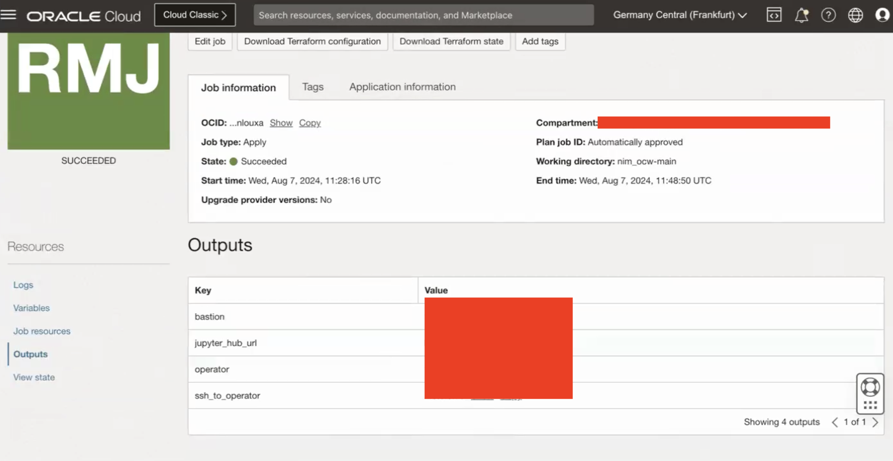
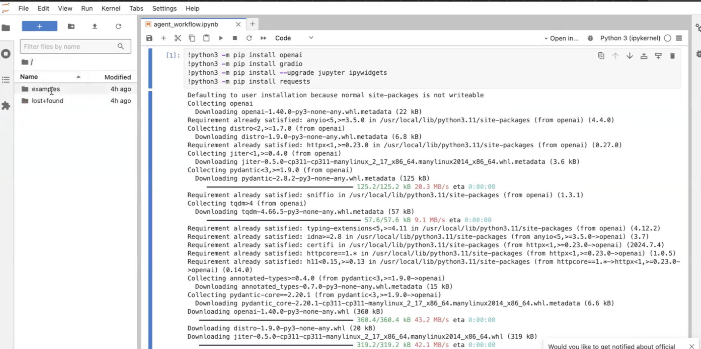
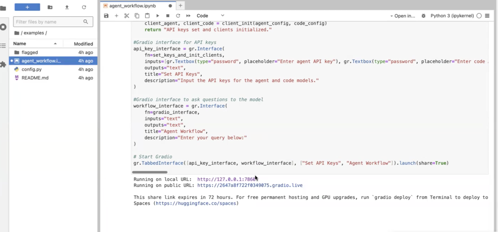
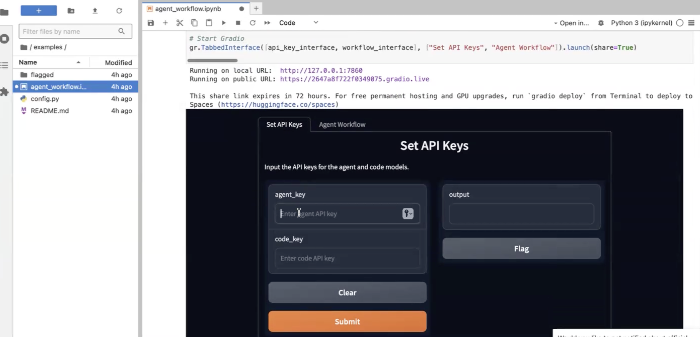
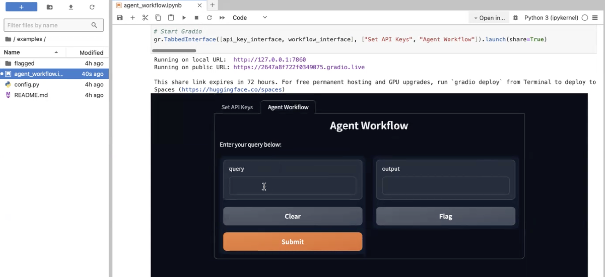

# Running an agent workflow

## Introduction

This lab will take you through the steps needed to run the JupyterHub notebook

Estimated Time: 1 hour 30 minutes

### Objectives

Demonstration of running an agent workflow using Lllama3 8B(NIM) as main agent, CodeLlama7B(vLLM) and CuOpt(NIM) as subsidiary agents in OKE using Gradio for the UI.

### Prerequisites

This lab assumes you have:

* An Oracle Cloud account
* Administrator permissions or permissions to use the OCI tenancy
* Ability to spin-up A10 instances in OCI
* Ability to create resources with Public IP addresses (Load Balancer, Instances, OKE API Endpoint)
* Access to HuggingFace, accept selected HuggingFace model license agreement.
* Accept CodeLlama7B HuggingFace model license agreement.
* Access to NGC Catalog for Llama3 and CuOpt NIMs.

## Task 1: Run JupyterHub Notebook

1. Once the job is succeeded go to Outputs and copy the JupyterHub URL to access JupyterHub as shown in the image below.

    

2. Paste the URL in a browser of your choice and provide the Username and Password which you seet in previous lab in Point 4.

3. It may take few seconds for pod to run the code on cluster. Just wait till the processing is complete.

## Task 2: Start Gradio Interface

1. On the left hand panel of the screen you will see examples. Click on it to view examples as shown in the image below and click on the *agentworkflow.ipynb* notebook.

    

2. Run the first block of code to install packages and dependencies. Reload the Kernel.

3. Run the second block of code. It will give you a public URL to access gradio interface as shown in the image below.

    

4. Next, you will have to provide the agent and code keys to access the interface as shown in the image below. Agent Key would be the Helm | VLLM - API KEY which we used to secure the model traffic in the previous lab on Point 12. Code Key is for the CodeLlama agent and Agent Key is for Llama3 agent. If you kept both as same NGC key in the previous lab you can use the same key for both code and agent here as well.

    

## Task 3: Run first workflow

1. Click on the Agent Workflow tab in the Gradio interface as shown below.

    

2. We will try the optimization query first using CuOpt model. In the query section copy and paste the following query and click on Submit.

    ```text
       <copy>
       Optimize the delivery routes for two delivery trucks. Truck 1 has a capacity of 15 units and starts at location [0, 0]. Truck 2 has a capacity of 3 units and starts at location [0, 0]. They need to deliver packages to locations [2, 2] with a demand of 2 units and [3, 3] with a demand of 15 unit. Both locations have a time window from 0 to 1080, and the service time at each location is 1 unit. The cost to travel between each location is provided in the following cost matrix: from [0, 0] to [2, 2] costs 10, from [0, 0] to (3, 3] costs 15, from [2,2] to [3, 3] costs 35.
       </copy>
    ```

    It will take about 30 seconds for it to process the query. Once we submit the query it goes to Llama3 which will decide where it should route the query to. Since it is an optimization query it will be routed to the CuOpt model which will generate the response and send it back to Llama3 and then Llama3 will generate the final response. You can see the workflow in the Output section.

## Task 4: Run second workflow

1. Next up we will try the CodeLlama agent. In the query section copy and paste the following query and click on Submit.

    ```text
       <copy>
       Generate a python code to retrieve odd numbers in a list.
       </copy>
    ```

    It will take about few seconds for it to process the query. Since this is a general topic so it would be answered by Llama3. You can see the workflow in the Output section.

## Task 5: Run third workflow

1. Next up we will try a general query. In the query section copy and paste the following query and click on Submit.

    ```text
       <copy>
       What is the capital of France?
       </copy>
    ```

You may now proceed to the next lab.

## Acknowledgements

**Authors**

* **Ionut Sturzu**, Principal Cloud Architect, NACIE
* **Abhinav Jain**, Senior Cloud Engineer, NACIE