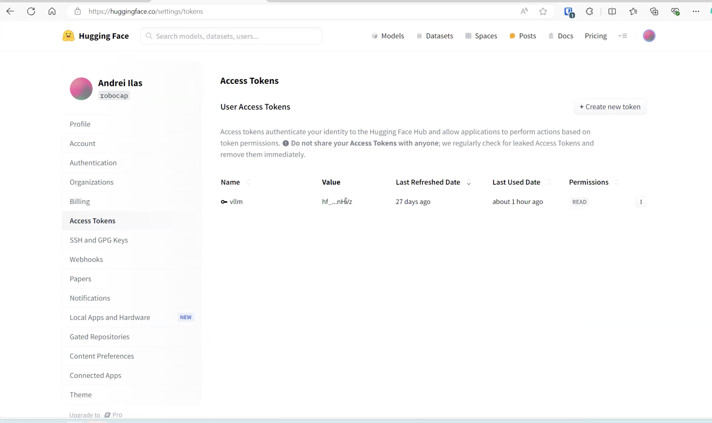
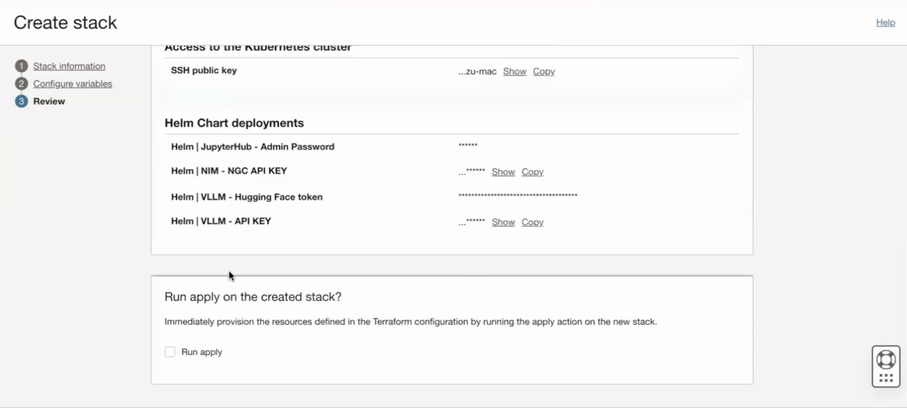
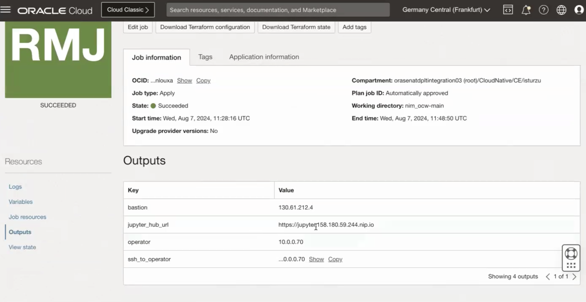

# Provision of resources to run Jupyter Notebook

## Introduction

This lab will take you through the steps needed to provision the infrastructure using Resource manager.

Estimated Time: 30 minutes

### Objectives

Provisioning of infrastructure using Resource manager.

### Prerequisites

This lab assumes you have:

* An Oracle Cloud account
* Administrator permissions or permissions to use the OCI tenancy
* Ability to spin-up A10 instances in OCI
* Ability to create resources with Public IP addresses (Load Balancer, Instances, OKE API Endpoint)
* Access to HuggingFace, accept selected HuggingFace model license agreement.
* Accept CodeLlama7B HuggingFace model license agreement.
* Access to NGC Catalog for Llama3 and CuOpt NIMs.

## Task 1: Provision resources

1. Go to Resource manager -> Stacks -> Creat Stack. Choose My configuration and upload the provided zip file and click Next: [nim_ocw-main-2.zip](https://objectstorage.us-ashburn-1.oraclecloud.com/p/_6xhcBfNAwTr5mm0O1pP-8wuFyk9IUkNsMyKdwLXejLdE-SRiZDLTqwEiDdPgJo5/n/c4u02/b/hosted_workshops/o/nim_ocw-main-2.zip)

    

2. Provide the information for **Compartment**, **Kubernetes Cluster Name (Any suitable name)** , **Check Create new VCN**, **VCN Name (Any suitable name)**, **Leave other Networking information as default**, **Kubernetes nodepool configuration (You have to keep GPU Nodepool size as 3 rest you can leave them as default or change according to your preference)**

3. Next, check all 3 options in Access to the Kubernetes cluster and provide your ssh key to connect to the bastion and operator hosts.

4. Next, in Helm Chart deployments section check all the 3 boxes and leave them as default. No need to provide the optional file. JupyterHub provides the access to the application using the browser. Provide a suitable username and password to access the application in the next lab.

5. Leave JupyterHub - Playbooks Git Repo as default.

6. Check Helm | Deploy nVidia NIM LLM box

7. Keep the Helm | NIM - Container image repo as default *nvcr.io/nim/meta/llama3-8b-instruct*

8. Keep the Helm | NIM - Container image tag as default *latest*

9. To generate Helm | NIM-NGC API KEY - Follow the steps listed in the following link to generate an api key. [NGC API Key](https://docs.nvidia.com/ai-enterprise/deployment-guide-spark-rapids-accelerator/0.1.0/appendix-ngc.html)

10. Check Helm | VLLM - deploy vllm box

11. You will need to go to HuggingFace website and create an account and generate a token to use here. Go to huggingface.co and create an account.

    Go to Profile -> Settings -> Access Tokens and generate a token as shown below

    

12. Helm | VLLM - API KEY can be any key to secure the model traffic. You can reuse the NGC API Key or provide any other key. For example it could be my-secret-key.

13. The model is fetched from HuggingFace so you have to connect to HuggingFace. The default model is 'meta-llama/CodeLlama-7B-Instruct-hf'.

14. Leave max_model_len as default *8192*

15. Check Helm | NIM - Cuopt box to deploy cuopt model.

16. Leave Helm | NIM Cuopt - cuopt helm chart link as default *https://helm.ngc.nvidia.com/nvidia/charts/cuopt-24.03.00.tgz*

17. Click Next and then select Run Apply and finally click on Create as shown below.

    

18. Wait for the Job to succeed. It may take 10-15 minutes for it to be successful and before infrastructure is provisioned.

19. Once the job is succeeded go to Outputs and copy the JupyterHub URL to access JupyterHub as shown in the image below.

    

You may now proceed to the next lab.

## Acknowledgements

**Authors**

* **Ionut Sturzu**, Principal Cloud Architect, NACIE
* **Abhinav Jain**, Senior Cloud Engineer, NACIE