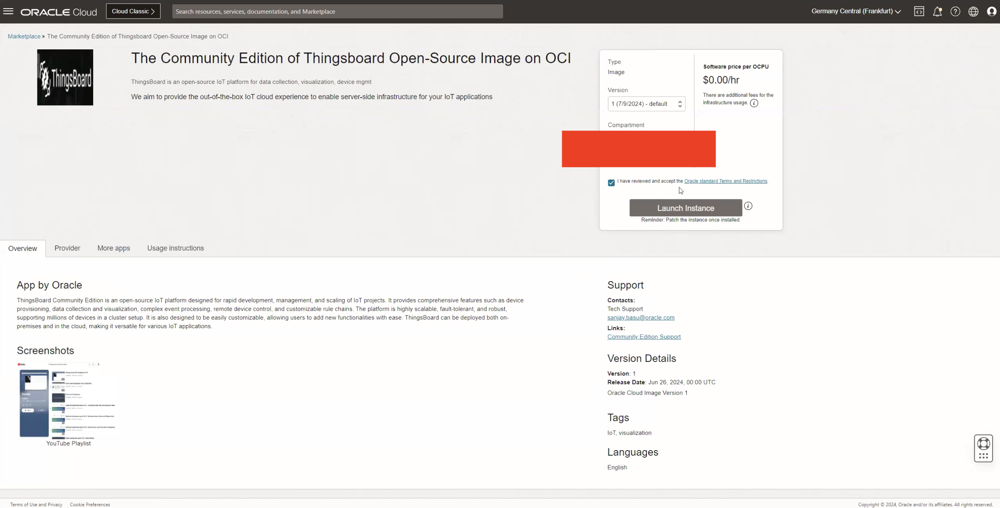

# Introduction

## About this Workshop

OCI currently lacks an IoT solution, so we're exploring a third-party option called ThingsBoard. This platform gathers data from various devices and supports diverse industries, including healthcare. The data passes through ThingsBoard, where it may undergo transformation, preparing it for ingestion into OCI. Integration occurs via OCI Streaming, enabling further utilization across different services. To deploy ThingsBoard, you can obtain a VM through the Marketplace image and access its interface using a public IP address.

Estimated Workshop Time: 2 hours

### Objectives

Objective of this workshop is to set-up Thingsboard and send data to be ingested into OCI using OCI Streaming:

In this workshop, you will learn how to:

* Configure & set-up Thingsboard
* Configure & set-up OCI Streaming and send data from Thingsboard to it

### Prerequisites

This lab assumes you have:

* An Oracle Cloud account
* Administrator permissions or permissions to use the OCI Streaming, OCI Compute and Identity Domains

## Learn More

* [What Is Thingsboard? How Does It Work?](https://thingsboard.io/)
* [Getting Started with Thingsboard](https://thingsboard.io/docs/getting-started-guides/helloworld/)
* [Installing Thingsboard](https://thingsboard.io/docs/user-guide/install/rhel/)
* [Getting Started with Thingsboard Rule Engine](https://thingsboard.io/docs/user-guide/rule-engine-2-0/re-getting-started/)
* [OCI Streaming](https://docs.oracle.com/en-us/iaas/Content/Streaming/home.htm)

You may now proceed to the next lab.

## Acknowledgements

**Authors**

* **Adina Ion-Nicolescu**, Senior Cloud Engineer, NACIE
* **Abhinav Jain**, Senior Cloud Engineer, NACIE