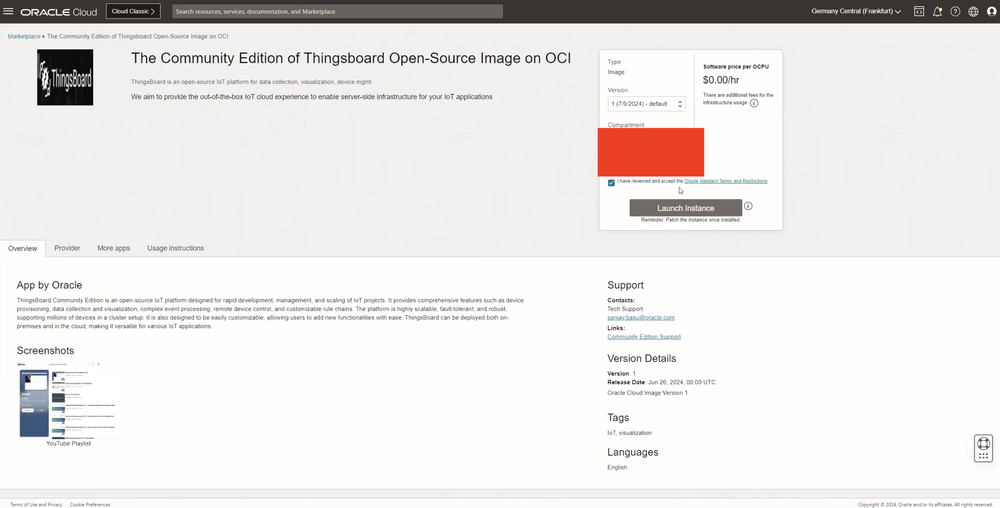
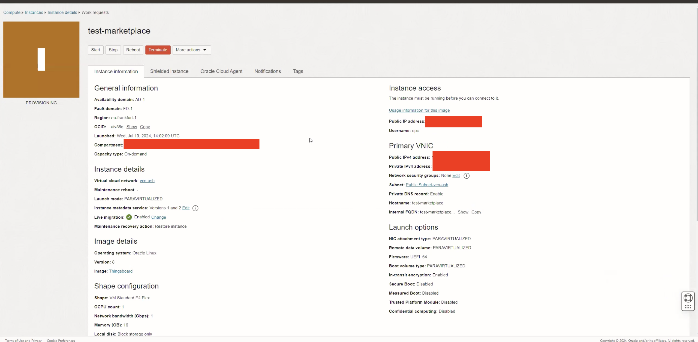
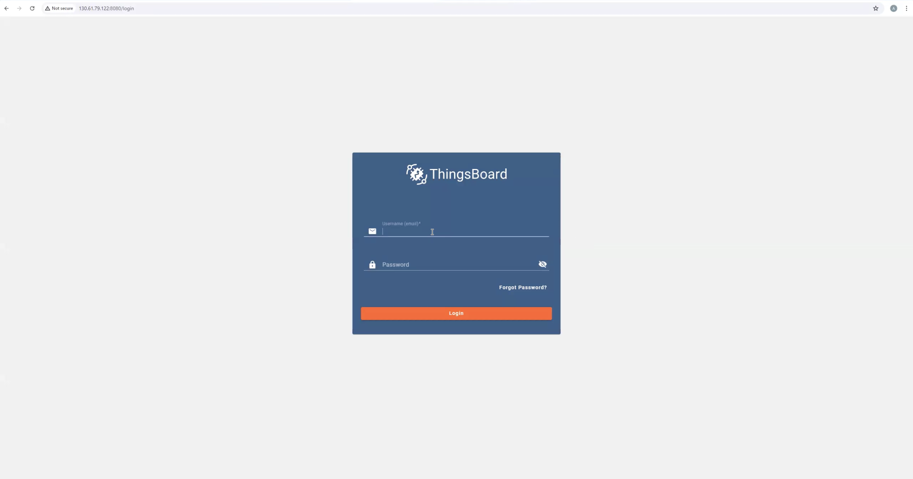

# Provisioning of Thingsboard instance

## Introduction

This lab will take you through the steps needed to provision Thingsboard instance.

Estimated Time: 30 minutes

### About Thingsboard

ThingsBoard is an open-source IoT platform for data collection, processing, visualization, and device management

### Objectives

Provisioning of Thingsboard instance

### Prerequisites

This lab assumes you have:

* An Oracle account
* Administrator permissions or permissions to use the OCI Streaming, OCI Compute and Identity Domains

## Task 1: Launch Thingsboard using Marketplace

Go to Marketplace -> All Applications and search for Thingsboard. Choose your compartment and click on Launch Instance.

This task will help you to create Thingsboard VM under your chosen compartment.

1. Provide the information for **Compartment**, **Name** , **Availability Domain**, **Image (Keep it as it is)**, **Shape (Keep as it is or select according to your choice)**, **VCN**, **Subnet (It has to be Public)**, **Add SSH Keys (Add keys to access your instance)**

    Click **Create**

    

## Task 2: Access Thingsboard UI

1. In a few minutes the status of recently created  instance will change from **Provisioning** to **Running**

    

When the ThingsBoard VM is ready, it may take up to an additional 2 minutes for the ThingsBoard UI to initialize. After that, you can access it on the public IP of the instance via port 8080, making the complete address ‘http://PublicIP:8080,’ as shown in the image below.

> **Note**
    > Port 8080 should be open so you can access UI using the browser.

2. Login to the Thingsboard UI using the following credentials

* **Username** : tenant@thingsboard.org
* **Password** : tenant

You may now proceed to the next lab.

## Acknowledgements

**Authors**

* **Adina Ion-Nicolescu**, Senior Cloud Engineer, NACIE
* **Abhinav Jain**, Senior Cloud Engineer, NACIE