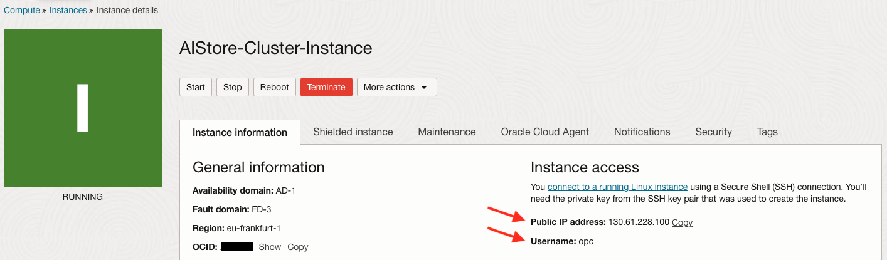
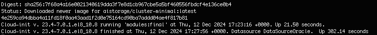
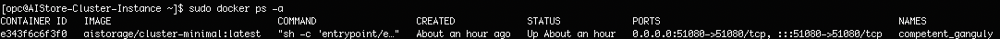
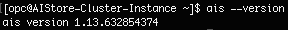
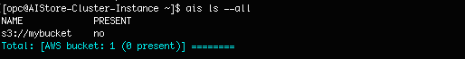
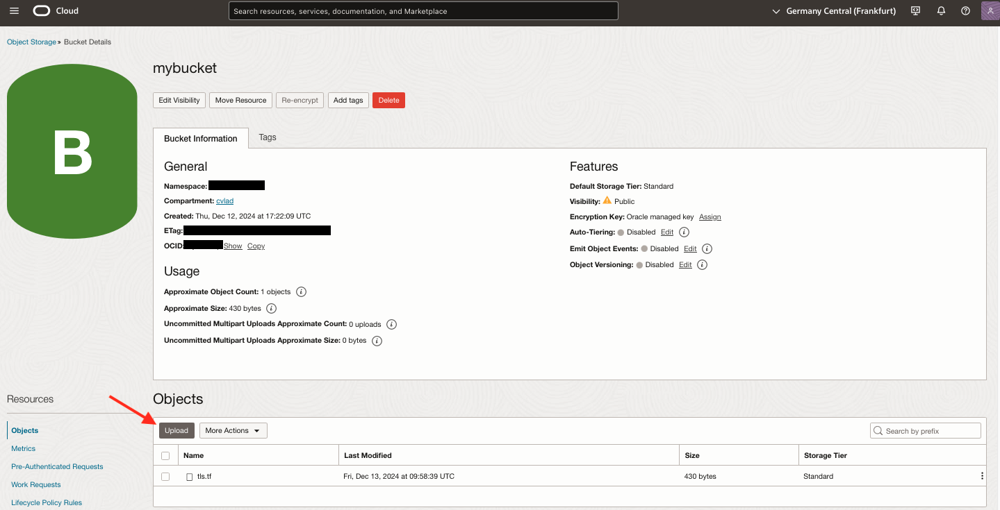
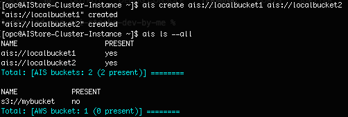
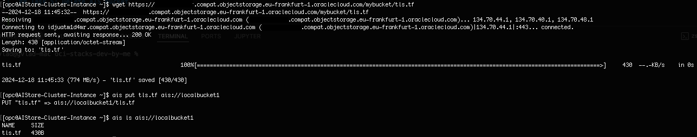
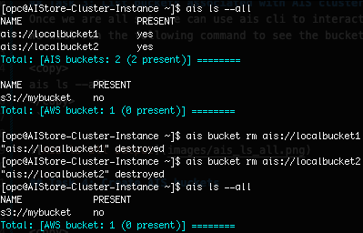

# AIStore CLI

## Introduction

This lab will demonstrate how to use a deployed AIStore cluster into OCI environment using AIS CLI commands.
 
Estimated Workshop Time: 30 min

### Objectives

This lab will guide you through how to:
- use AIStore to list buckets in OCI
- use AIS CLI to copy from OCI to AIS and delete from AIS 

### Prerequisites

This lab assumes you have:

* Lab 1. Provision of OCI infrastructure completed

## Task 1: SSH into VM Instance
Go in OCI console under Compute -> Instances and take the public ip of the instance and username to ssh into it.


## Task 2: Verify cloudinit has finished and all required tools are installed
Use the following command to see the cloudinit has finished:
```
<copy>
tail -f -n 100 /var/log/cloud-init-output.log 
</copy>
```
If you see something like in the screenshot bellow it means the cloudinit execution has finished:


Use the following command to see the docker is installed and the ais cluster docker is running:
```
<copy>
sudo docker ps -a 
</copy>
```



Use the following commands to see ais cli is installed:
```
<copy>
ais --version 
</copy>
```



If the docker is up and running and ais cli is installed, use the following command to set the ais cluster endpoint:
```
<copy>
ais config cli set cluster.url=http://localhost:51080
</copy>
```

## Task 3: List buckets associated with AIS cluster
Once we are all set, we can use ais cli to interact with the AIS cluster deployed in the docker container.
We will run the following command to see the bucket that we created within the automation is available in the AIS cluster:
```
<copy>
ais ls --all
</copy>
```



## Task 4: Create AIS buckets and copy object from OCI bucket into AIS bucket

First lets add a file tls.tf into mybucket in OCI console:
```
<copy>
# tls.tf
# Copyright (c) 2024 Oracle Corporation and/or its affiliates.
# Licensed under the Universal Permissive License v 1.0 as shown at https://oss.oracle.com/licenses/upl

locals {
  user_public_ssh_key     = chomp(var.ssh_public_key)
  bundled_ssh_public_keys = "${local.user_public_ssh_key}\n${chomp(tls_private_key.stack_key.public_key_openssh)}"
}

resource "tls_private_key" "stack_key" {
  algorithm = "RSA"
  rsa_bits  = 4096
}
</copy>
```


Then lets create AIS bucket:
```
<copy>
ais create ais://localbucket1 ais://localbucket2

</copy>
```




Once we have AIS buckets created, lets copy objects from OCI object storage to AIS buckets:
```
<copy>
wget https://<bucket_namespace>.compat.objectstorage.eu-frankfurt-1.oraclecloud.com/mybucket/tls.tf
ais put tls.tf ais://localbucket1
ais ls ais://localbucket1
</copy>
```


## Task 5: Delete AIS bucket 

We will cleanup the AIS buckets from the cluster with the following commands:
```
<copy>
ais bucket rm ais://localbucket1
ais bucket rm ais://localbucket2
</copy>
```



## Learn More

* [What is cohort?](https://kueue.sigs.k8s.io/docs/concepts/cluster_queue/#cohort)


## Acknowledgements

**Authors**

* **Cristian Vlad**, Principal Cloud Architect, NACIE
* **Last Updated By/Date** - Cristian Vlad, December 2024