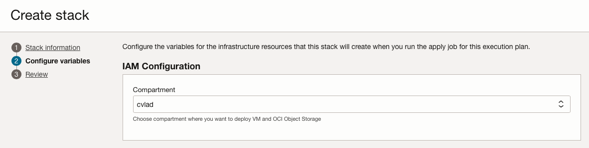
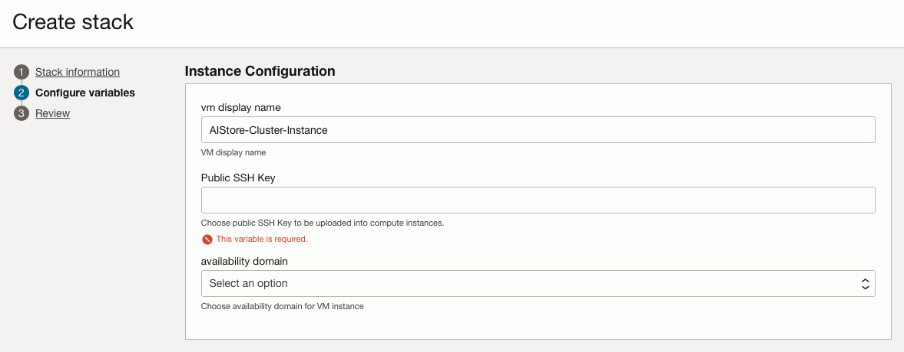
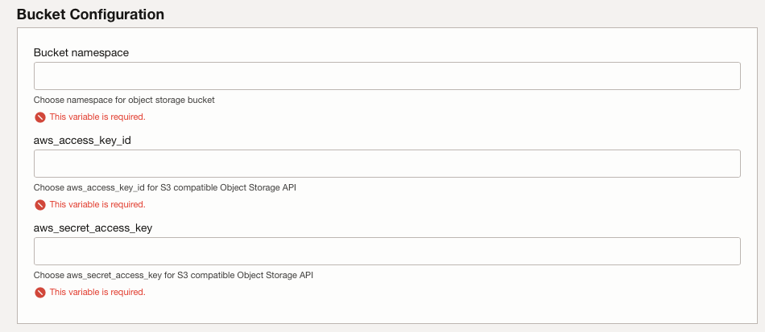
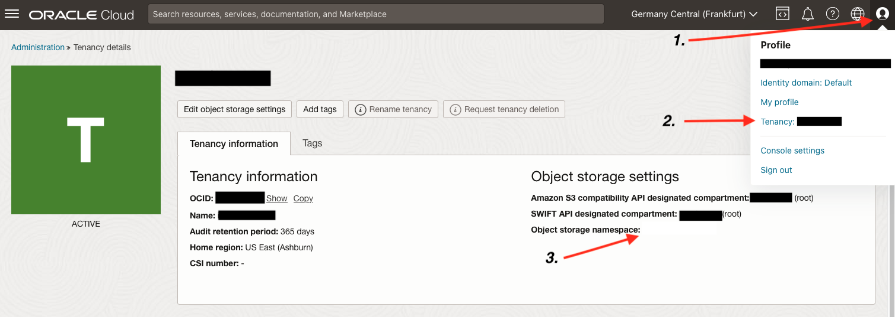
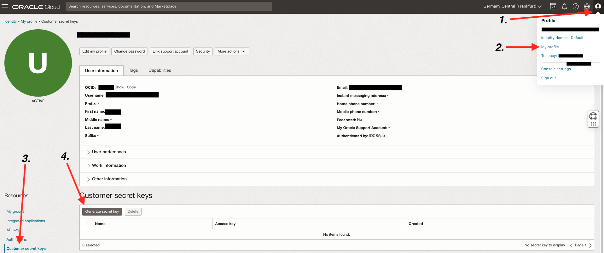

# Provision of OCI infrastructure

## Introduction

This lab will guide you through the steps needed to provision the infrastructure using the Resource Manager.

Estimated Time: 5 minutes

### **Objectives**

Provisioning of the infrastructure using OCI Resource Manager.

### **Prerequisites**

This lab assumes you have:

* An Oracle Cloud account
* Administrator permissions or permissions to use the OCI Compute and OCI Object Storage
* Ability to provision Flex shape vm instances in OCI

## Task 1: Provision resources

1. Go to Resource manager -> Stacks -> Create Stack. Choose My configuration and upload the provided zip file and click Next: [ORM zip file](https://github.com/vladcristi/orm-stack-aistore-in-oci/archive/refs/heads/main.zip)

    

    Or you could use the single click deployment button shown below

    

2. Provide the following information: 

**Compartment**: Choose the appropriate compartment where to deploy VM instance.

**Create New VCN**: Check the option to create a new VCN and you can leave networking details as default.

**VM Instance Configuration**: In this section you will need to provide your public SSH key and select and Availability Domain in which the VM instance whill be deployed. The VM display you can leave as default.

**Object Storage Configuration**: In this section you will need to provide bucket namespace, access key id and secret access key.

The bucket namespace you can retrieve following the steps in the image bellow:

The access key id and secret access key you can get following the steps in the image bellow:

3. Click Next and then select Run Apply and finally click on Create as shown below.

4. Wait for the job to complete, which may take aproximatively 4-5 minutes before the infrastructure is fully provisioned.

You may now proceed to the next lab.

## Acknowledgements

**Authors**

* **Cristian Vlad**, Principal Cloud Architect, NACIE
* **Last Updated By/Date** - Cristian Vlad, December 2024
