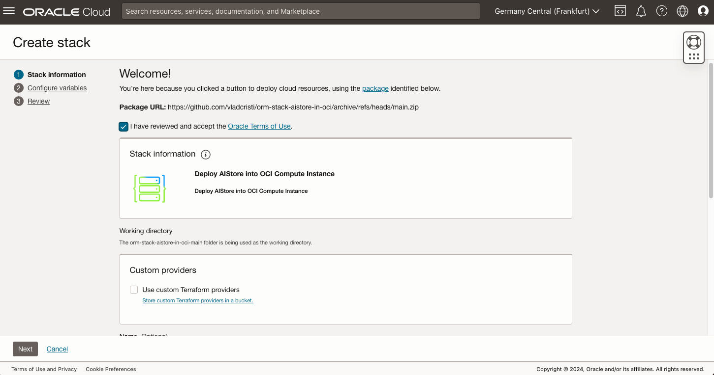
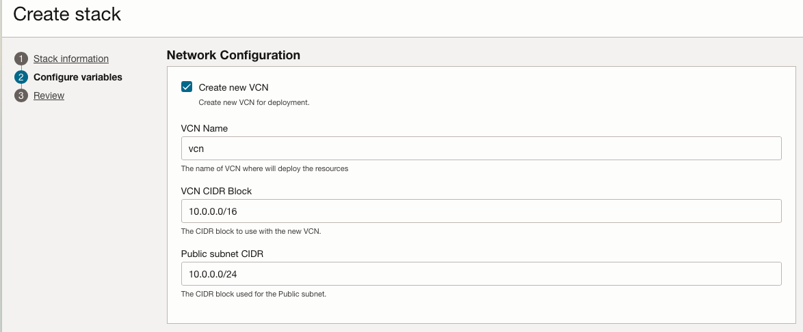
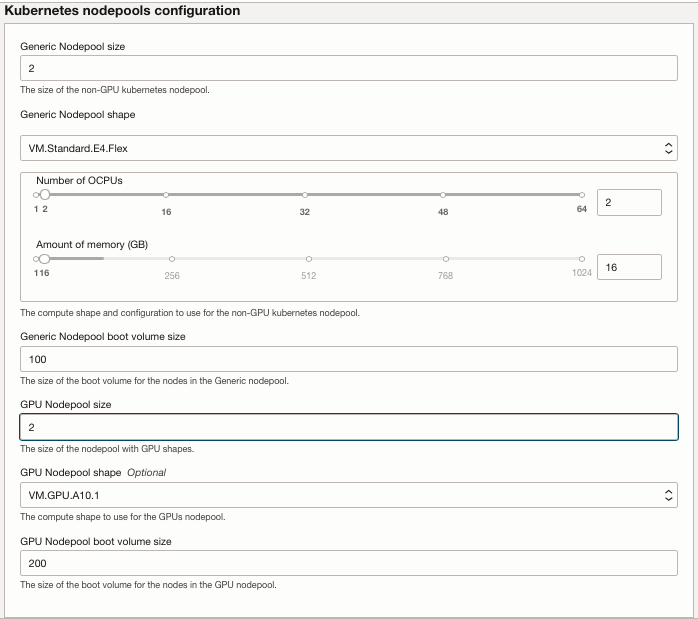
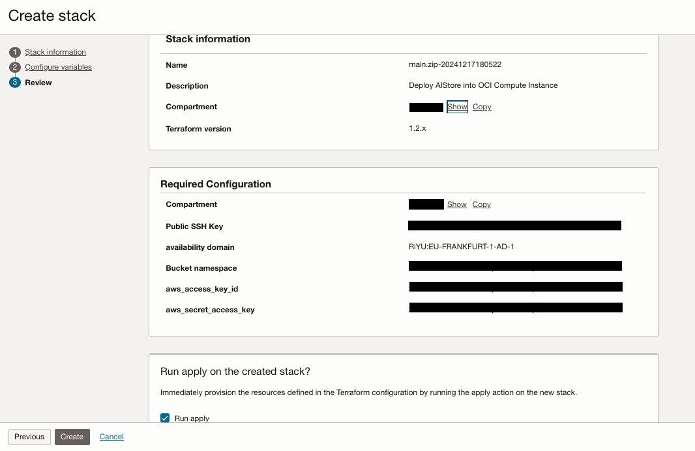

# Provision of OCI infrastructure

## Introduction

This lab will guide you through the steps needed to provision the infrastructure using the Resource Manager.

Estimated Time: 5 minutes

### **Objectives**

Provisioning of the infrastructure using OCI Resource Manager.

### **Prerequisites**

This lab assumes you have:

* An Oracle Cloud account
* Administrator permissions or permissions to use the OCI Compute, OKE and Identity Domains
* Ability to provision A10 vm instances in OCI

## Task 1: Provision resources

1. Go to Resource manager -> Stacks -> Create Stack. Choose My configuration and upload the provided zip file and click Next: [ORM zip file](https://github.com/vladcristi/orm-stack-aistore-in-oci/archive/refs/heads/main.zip)

    

    Or you could use the single click deployment button shown below

    

2. Provide the following information: 

**Select Compartment**: Choose the appropriate compartment for the Kubernetes cluster.

**Cluster Name**: Enter a descriptive name for the cluster.

**Create New VCN**: Check the option to create a new VCN, provide a name, and leave other networking details as default.

**Node Pool Configuration**: Set the GPU node pool size to 2; leave other settings as default or adjust as needed.

3. Next, we have 3 options in Access to the Kubernetes cluster and provide your ssh key to connect to the bastion and operator hosts.

    You can deploy the resources in two ways: 
    - you check "Create a bastion and operator hosts" and "Create operator IAM policy". In this way the operator host would be configured with kubectl so you can directly execute command from operator against the kubernetes cluster 
    - you don't check "Create a bastion and operator hosts" and "Create operator IAM policy" and you check "Create public OKE API" and commands can be executed from oracle resource manager runner.

    Note: If you create bastion and operator hosts then creating a public oke endpoint is optional. 
    
    For this workshop you will check "Create a bastion and operator hosts" and "Create operator IAM policy" and provide your public key to connect to the bastion and operator hosts.

5. Next, in Helm Chart deployments section check all the 2 boxes and leave them as default. 

6. Click Next and then select Run Apply and finally click on Create as shown below.

13. Wait for the job to complete, which may take aproximatively 15-20 minutes before the infrastructure is fully provisioned.

You may now proceed to the next lab.

## Acknowledgements

**Authors**

* **Cristian Vlad**, Principal Cloud Architect, NACIE
* **Last Updated By/Date** - Cristian Vlad, October 2024
