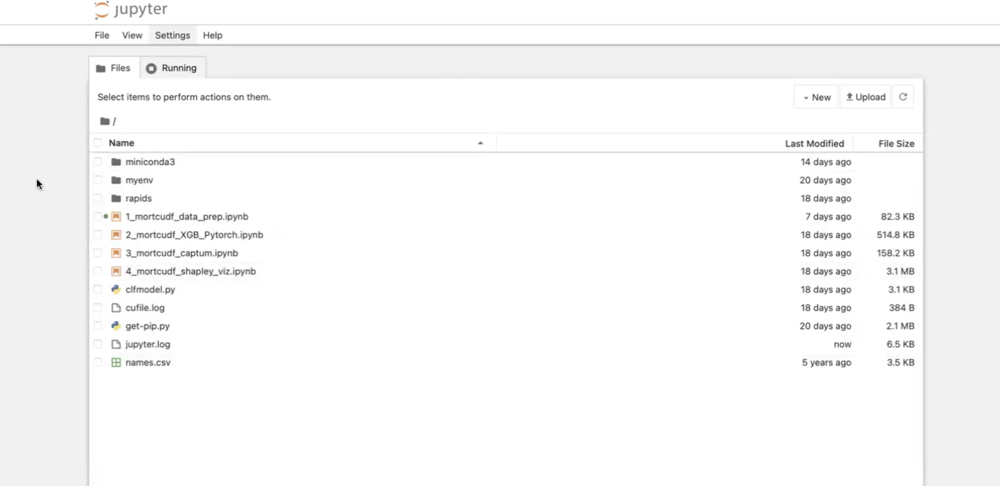
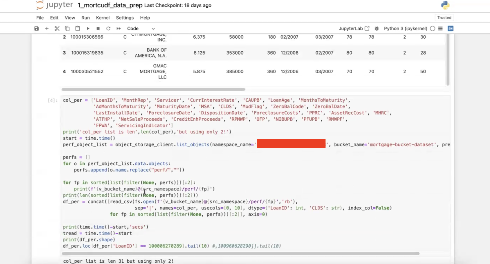

# Run Jupyter Notebook

## Introduction

This lab will take you through the steps needed to run examples in the jupyter notebook. We have following notebooks

* 1 mortcudf data prep.ipynb**
* 2 mortcudf XGB Pytorch.ipynb**
* 3 mortcudf captum.ipynb**
* 4 mortcudf shapley viz.ipynb**

with RAPIDS ETL code, XGBoost classifier code, SHAP value code, PyTorch classifier code, Captum code, Shapley Clustering and Visualization

Estimated Time: 1 hour 30 minutes

### Objectives

To execute XGBoost classifer for predicting loan delinquencies

### Prerequisites

This lab assumes you have:

* An Oracle Cloud account
* Administrator permissions or permissions to use the OCI Compute and Identity Domains
* Access to A10 or GPU shape, Usage of the Terraform code for one click deployment.

## Task 1: Run Notebook examples

1. Copy the URL created in the last lab and paste in a browser of your choice to access Jupyter Notebooks as shown in the image below.

    

2. We will go through all the notebooks one by one. Click on *1 mortcudf data prep.ipynb* to open first notebook. Here you will need to upload the dataset in the object storage bucket mentioned here in the image below

    

3. Go to Object Storage in OCI Console and upload dataset in the above mentioned bucket. Access dataset from here. Keep in mind this dataset is huge close to 195GB in size so you need appropriate space in your system to download it and then you will have to upload it to the OCI Object Storage. [http://rapidsai-data.s3-website.us-east-2.amazonaws.com/notebook-mortgage-data/mortgage_2000-2016.tgz](http://rapidsai-data.s3-website.us-east-2.amazonaws.com/notebook-mortgage-data/mortgage_2000-2016.tgz)

4. Run all the code blocks in the notebook to go through this example.

5. Next, we will run remaining 3 other notebooks one by one.

This concludes our Workshop.

## Acknowledgements

**Authors**

* **Cristian Vlad**, Principal Cloud Architect, NACIE
* **Abhinav Jain**, Senior Cloud Engineer, NACIE