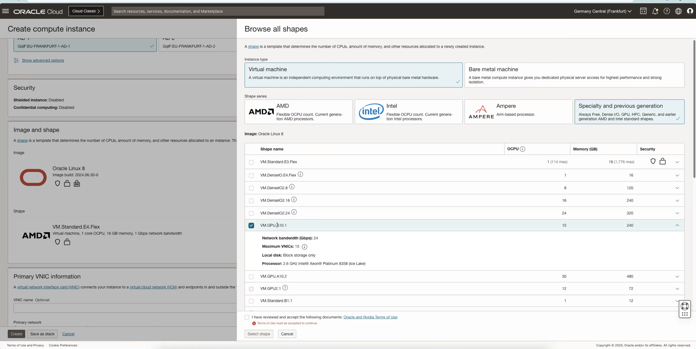
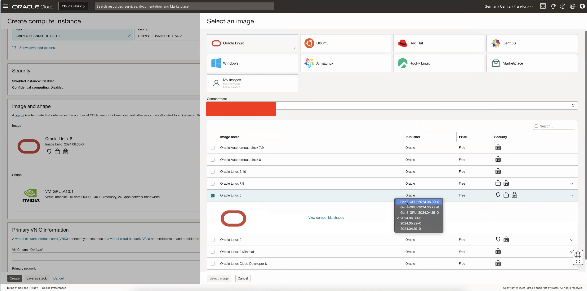
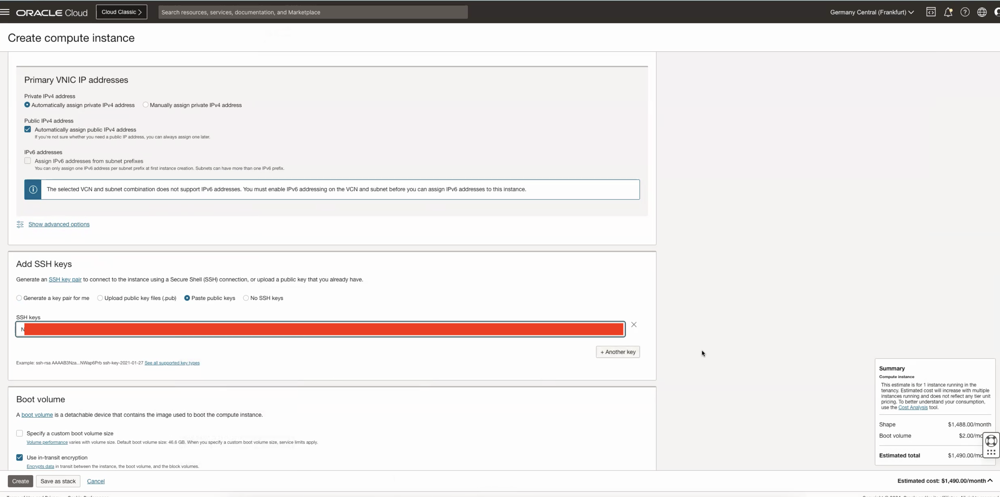

# Provision of Nvidia Container

## Introduction

This lab will take you through the steps needed to provision Nvidia container on oci instance with an A10 shape which has GPU,

Estimated Time: 45 minutes

### About NVIDIA cuOpt

NVIDIA cuOpt is an optimization tool that specializes in routing. It is run as a microservice in the cloud using the container provided. The cuOpt microservice leverages OpenAPI standards, serving endpoints running on port 5000 (by default) to accept optimization input data and return optimized routing solutions.

### Objectives

Provisioning of Nvidia container

### Prerequisites

This lab assumes you have:

* An Oracle account
* Administrator permissions or permissions to use the OCI Compute, Identity Domains, A10 images, NGC API Key.

## Task 1: Launch an A10 instance

1. Go to Compute -> Instance -> Create Instance. Under Image and Shape choose A10 shape as shown in the image below.

    

2. Click on Change Image and select Gen2-GPU-2024 (one on the top) as Image Build under Oracle Linux 8. Shown in the image below.

    

3. Provide the information for **VCN**, **Subnet (It has to be Public)**, **Add SSH Keys (Add keys to access your instance)**

Click **Create**



## Task 2: Run Nvidia Container

1. In few minutes the status of recently created  instance will change from **Provisioning** to **Running**. 

2. Access the instance using the public ip of the instance with the following command 'ssh -i <ssh_key> opc@public_ip'.

3. Install nvidia-container-toolkit

    ```text
        <copy>
        curl -s -L https://nvidia.github.io/libnvidia-container/stable/rpm/nvidia-container-toolkit.repo | sudo tee /etc/yum.repos.d/nvidia-container-toolkit.repo
        </copy>
    ```

4. Run the following command

    ```text
        <copy>
        sudo yum install -y nvidia-container-toolkit
        </copy>
    ```

5. Generate CDI configuration for podman

    ```text
        <copy>
        sudo nvidia-ctk cdi generate --output=/etc/cdi/nvidia.yaml
        </copy>
    ```

6. Setup nvidia driver to be persistent across reboots

    ```text
        <copy>
        sudo nvidia-persistenced
        </copy>
    ```

7. Run the following command.

    ```text
        <copy>
        sudo systemctl enable nvidia-persistenced
        </copy>
    ```

8. Install podman

```text
    <copy>
   sudo dnf module install -y container-tools:ol8
    </copy>
```

9. Allow containers to use device files

```text
    <copy>
    sudo setsebool -P container_use_devices 1
    </copy>
```

```text
    <copy>
    sudo setsebool -P container_manage_cgroup on
    </copy>
```

## Task 3: Generate NGC API Key

Follow the steps listed in the following link to generate an api key which will be used in next task. [NGC API Key](https://docs.nvidia.com/ai-enterprise/deployment-guide-spark-rapids-accelerator/0.1.0/appendix-ngc.html)

## Task 4: Continue with Steps to run the container

1. Login to nvcr.io. Use the api key generated in previous step.

    ```text
        <copy>
        sudo podman login nvcr.io --username '$oauthtoken' --password $api_key
        </copy>
    ```

2. Pull cuopt from nvcr.io

    ```text
        <copy>
        sudo podman pull nvcr.io/nvidia/cuopt/cuopt:25.08
        </copy>
    ```

3. Create systemd service file for cuopt

    ```text
        <copy>
        sudo tee /etc/systemd/system/cuopt.service <<EOF
        [Unit]
        Description=Podman cuopt Container
        After=network.target
        [Service]
        Type=simple
        Restart=always
        ExecStart=/usr/bin/podman run --rm --device nvidia.com/gpu=all -p 5000:5000 nvcr.io/nvidia/cuopt/cuopt:25.08
        [Install]
        WantedBy=multi-user.target
        EOF
        </copy>
    ```

4. Reload systemd and start the service

    ```text
        <copy>
        sudo systemctl daemon-reload
        </copy>
    ```

    ```text
        <copy>
        sudo systemctl start cuopt.service
        </copy>
    ```

5. Enable automatic start on boot

    ```text
        <copy>
        sudo systemctl enable cuopt.service
        </copy>
    ```

## Task 5: Test cuOpt with an API call

Run the following command to test the container

```text
    <copy>
   curl --location 'http://0.0.0.0:5000/cuopt/routes' \
   --header 'Content-Type: application/json' \
   --header "CLIENT-VERSION: custom" \
   -d '{
    "cost_matrix_data": {"data": {"0": [[0, 1], [1, 0]]}},
    "task_data": {"task_locations": [1], "demand": [[1]], "task_time_windows": [[0, 10]], "service_times": [1]},
    "fleet_data": {"vehicle_locations":[[0, 0]], "capacities": [[2]], "vehicle_time_windows":[[0, 20]] },
    "solver_config": {"time_limit": 2}
    }'
    </copy>
```

## Acknowledgements

**Authors**

* **Guido Alejandro Ferreyra**, Principal Cloud Architect, NACIE
* **Abhinav Jain**, Senior Cloud Engineer, NACIE

**Last Updated By/Date:**
* **Abhinav Jain**, Senior Cloud Engineer, NACIE, August 2025