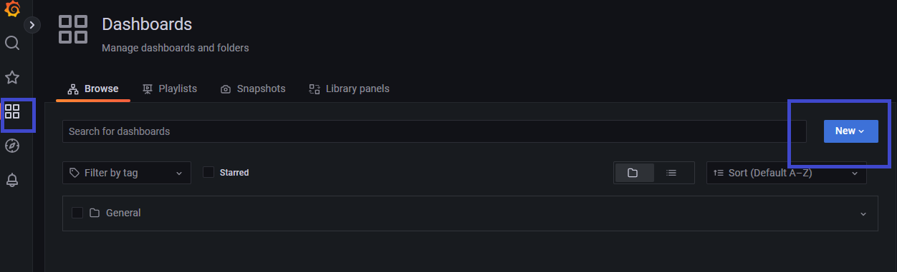
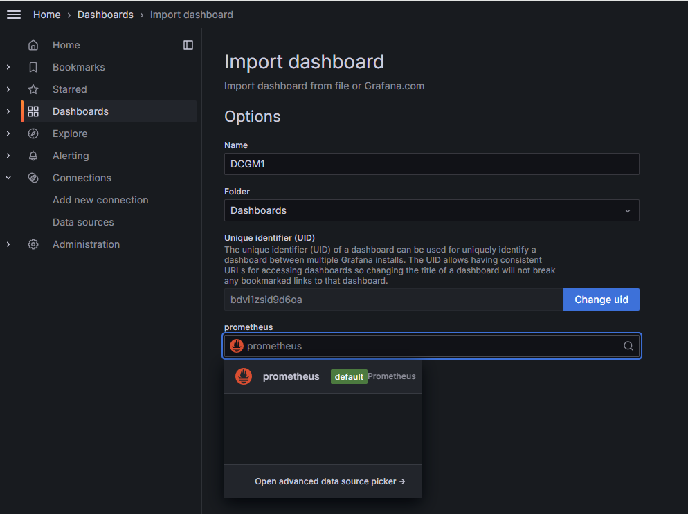
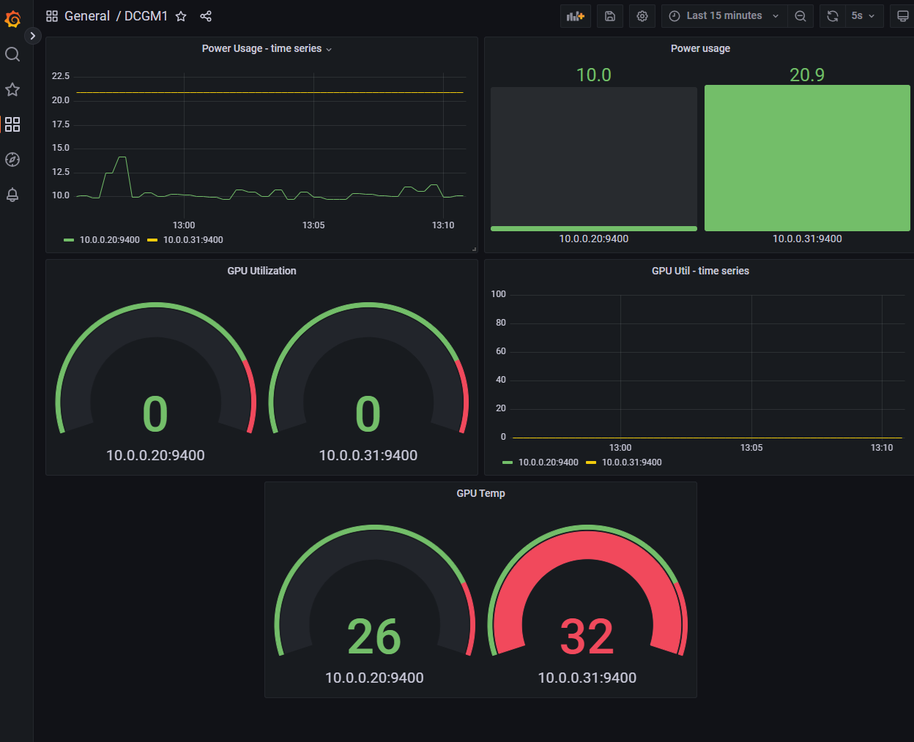
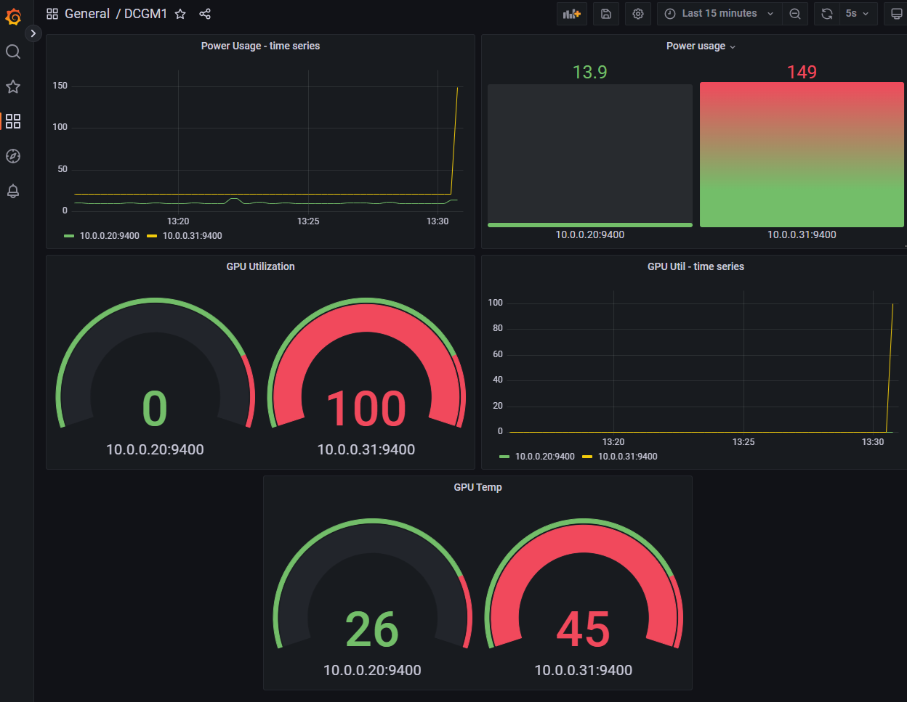

# Simulate activity on the GPU machines and review metrics in Grafana

## Introduction

This lab will guide you through the steps to simulate activity on the available GPUs and monitor the results using Grafana dashboards

Estimated Time: 30 minutes

### Objectives

* Simulating GPU Activity: Generate workload on the available GPUs to produce relevant performance metrics.
* Visualizing Metrics in Grafana: Integrate Prometheus as a data source in Grafana and review GPU performance data on pre-configured dashboards.

### Prerequisites

This lab assumes you have:

* An Oracle Cloud account
* Administrator permissions or permissions to use the OCI Compute and OCI Networking services
* Access to the previously deployed A10 or GPU shape

## Task 1: Import Grafana dashboard

To view the metrics from the two configured targets, you can set up a Grafana dashboard. This lab provides a file that you can import into Grafana to visualize GPU-related metrics.

1. Download locally the file [grafana\_dcgm\_dashboard.json](https://c4u04.objectstorage.us-ashburn-1.oci.customer-oci.com/p/EcTjWk2IuZPZeNnD_fYMcgUhdNDIDA6rt9gaFj_WZMiL7VvxPBNMY60837hu5hga/n/c4u04/b/livelabsfiles/o/labfiles%2Fgrafana_dcgm_dashboard.json)

2. Go to _Grafana_ (`http://<demo_grafana public_IP>:3000`) -> _Dashboards_ -> _New_

    

3. Import the file you downloaded: _Dashboard_ -> _Import_

    

    * Use the `Upload JSON file` button to load the downloaded file.

4. Select the Prometheus data source you configured previously. Then click **Import**.

    

5. See that the dashboard is visible.

    

## Task 2: Run load on the Linux GPU

1. To generate load on the Oracle Linux target VM, you will execute specific commands. First, connect to the public IP of the Linux A10 GPU instance.

2. For load generation on the GPU, you can use the **gpu-burn** tool. 

    * Follow these steps to install and run it (Below, `600` specifies the duration of the GPU burn test in seconds):

        ```
        <copy>
        sudo dnf install git
        git clone https://github.com/wilicc/gpu-burn.git
        cd gpu-burn
        make
        ./gpu_burn 600
        </copy>
        ```

3. Check the dashboard to see the load increase and also compare to the Ubuntu which is not loaded.

    

**Final note** - remember to Stop the A10 instances after finishing the labs or destroying the stack alltogether.

## Acknowledgements

**Authors** 
* Adina Nicolescu, Senior Cloud Engineer, NACIE
* Francisc Vass, Principal Cloud Architect, NACIE

**Last Updated By/Date**
* Adina Nicolescu - Senior Cloud Engineer, NACIE - Dec 2024
