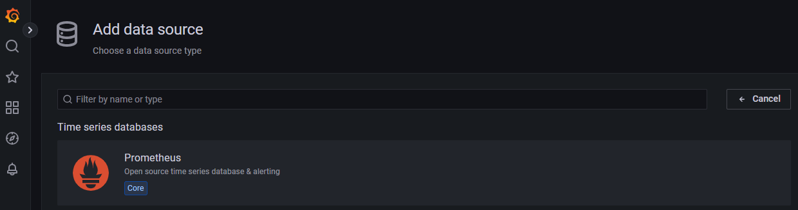

# Install & configure Prometheus and Grafana

## Introduction

In this lab, you will install Prometheus and Grafana on the separate VM deployed previously.

Estimated Time: 30 minutes

### Objectives

* Acces Linux VM previously deployed.
* Manually install Prometheus on the designated VM.
* Manually install Grafana on the designated VM.

### Prerequisites

This lab assumes you have:

* An Oracle Cloud account
* Administrator permissions or sufficient permissions to use OCI Compute and Networking services.

## Task 1: Install Prometheus

Follow these steps to install Prometheus on the **demo_grafana** VM. You can obtain it's public IP as explained at the end of the previous lab.

1. Connect to the `demo_grafana` VM:

    * In your local terminal, use the SSH private key corresponding to the public key provided during the ORM stack deployment to connect to the `demo_grafana` VM. Replace `<public-ip>` with the public IP of the VM:

        ```
        <copy>
        ssh -i <path-to-your-ssh-private-key> opc@<public-ip>
        </copy>
        ```

2. Download and extract Prometheus:
    
    * Use the below commands:

        ```
        <copy>
        wget https://github.com/prometheus/prometheus/releases/download/v2.37.6/prometheus-2.37.6.linux-amd64.tar.gz
        tar xvfz prometheus-*.tar.gz
        </copy>
        ```
3. Create required directories:

    * Create two directories for Prometheus:

        * `/etc/prometheus`: To store Prometheus configuration files.
        * `/var/lib/prometheus`: To hold application data.

        ```
        <copy>
        sudo mkdir /etc/prometheus /var/lib/prometheus
        </copy>
        ```

4. Navigate to the extracted Prometheus folder:

    * Go to the `prometheus-2.37.6.linux-amd64` folder:

        ```
        <copy>
        cd prometheus-2.37.6.linux-amd64
        </copy>
        ```

5. Move executables:

    * Move the `prometheus` and `promtool` binaries to `/usr/local/bin` to make Prometheus accessible globally, to all users:

        ```
        <copy>
        sudo mv prometheus promtool /usr/local/bin/
        </copy>
        ```

6. Move configuration file:

    * Move the `prometheus.yml` configuration file to `/etc/prometheus`:

        ```
        <copy>
        sudo mv prometheus.yml /etc/prometheus/prometheus.yml
        </copy>
        ```

7. Move console resources:

    * Move the `consoles` and `console_libraries` directories to `/etc/prometheus`. These contain resources for creating custom consoles (not covered in this guide):

        ```
        <copy>
        sudo mv consoles/ console_libraries/ /etc/prometheus/
        </copy>
        ```

8. Verify installation:

    * Check the Prometheus version to confirm the installation:

        ```
        <copy>
        prometheus --version
        </copy>
        ```

9. Instructions to disable SELinux:

    * Open the SELinux configuration file for editing:

        ```
        <copy>
        sudo vi /etc/selinux/config
        </copy>
        ```

    * Locate the line with SELINUX= and change its value to:

        ```
        <copy>
        SELINUX=disabled
        </copy>
        ```

    * Save the file and exit.

    * Reboot the system to apply the changes:

        ```
        <copy>
        sudo reboot
        </copy>
    ```


## Task 2: Configure Prometheus as a Service

Perform the below steps connected to the `demo_grafana` VM the same as you did for Prometheus installation:

1. Create a `prometheus` user:

    * Add a system user for Prometheus to run as a service:

        ```
        <copy>
        sudo useradd -rs /bin/false prometheus
        </copy>
        ```

2. Assign ownership of directories:

    * Grant the `prometheus` user ownership of the directories created earlier:

        ```
        <copy>
        sudo chown -R prometheus: /etc/prometheus /var/lib/prometheus
        </copy>
        ```

3. Create a systemd service file:

    * Configure Prometheus to run as a systemd service by creating a service file:

        ```
        <copy>
        sudo vi /etc/systemd/system/prometheus.service
        </copy>
        ```

    * Add the following content to the file:

        ```
        <copy>
        [Unit]
        Description=Prometheus
        Wants=network-online.target
        After=network-online.target

        [Service]
        User=prometheus
        Group=prometheus
        Type=simple
        Restart=on-failure
        RestartSec=5s
        ExecStart=/usr/local/bin/prometheus \
            --config.file /etc/prometheus/prometheus.yml \
            --storage.tsdb.path /var/lib/prometheus/ \
            --web.console.templates=/etc/prometheus/consoles \
            --web.console.libraries=/etc/prometheus/console_libraries \
            --web.listen-address=0.0.0.0:9090 \
            --web.enable-lifecycle \
            --log.level=info

        [Install]
        WantedBy=multi-user.target
        </copy>
        ```

4. Enable and start the service:

    * Reload the systemd daemon, enable the Prometheus service, and start it:

        ```
        <copy>
        sudo systemctl daemon-reload
        sudo systemctl enable prometheus
        sudo systemctl start prometheus
        </copy>
        ```

5. Check service status:

    * Verify that Prometheus is running:

        ```
        <copy>
        sudo systemctl status prometheus
        </copy>
        ```

6. Open port 9090 in the firewall:

    * Allow access to the Prometheus dashboard by opening port 9090:

        ```
        <copy>
        sudo systemctl stop firewalld
        sudo firewall-offline-cmd --zone=public --add-port=9090/tcp
        sudo systemctl start firewalld
        </copy>
        ```

7. Access Prometheus dashboard:

    * Open your browser and navigate to:

        ```
        <copy>
        http://<public-ip>:9090
        </copy>
        ```
        Replace `<public-ip>` with the public IP address of the Prometheus server.

## Task 3: Install Grafana

The next steps will walk you through the instructions to install Grafana, configure it, and connect it to Prometheus as a data source. These steps should be performed on the `demo_grafana` VM.

1. Create a new repository file:

    * This file will be the repo for Grafana:

        ```
        <copy>
        sudo vi /etc/yum.repos.d/grafana.repo
        </copy>
        ```

    * Add the following configuration to the file and save it:
        
        ```
        <copy>
        [grafana]
        name=grafana
        baseurl=https://packages.grafana.com/oss/rpm
        repo_gpgcheck=1
        enabled=1
        gpgcheck=1
        gpgkey=https://packages.grafana.com/gpg.key
        sslverify=1
        sslcacert=/etc/pki/tls/certs/ca-bundle.crt
        </copy>
        ```

2. Install Grafana and configure it as a service:

    * Use the dnf package manager for installation:
    
        ```
        <copy>
        sudo dnf install grafana -y
        </copy>
        ```

    * Enable Grafana to start at boot:
        
        ```
        <copy>
        sudo systemctl enable grafana-server
        </copy>
        ```

    * Start the Grafana service:

        ```
        <copy>
        sudo systemctl start grafana-server
        </copy>
        ```

    * Check Grafana's status to ensure it's running:

        ```
        <copy>
        sudo systemctl status grafana-server
        </copy>
        ```

3. Configure the firewall for Grafana, which operates on port `3000` by default. 

    * To allow access, stop the firewall temporarily, open port `3000` and restart the firewall:

        ```
        <copy>
        sudo systemctl stop firewalld
        sudo firewall-offline-cmd --zone=public --add-port=3000/tcp
        sudo systemctl start firewalld
        </copy>
        ```

4. Access Grafana:

    * Use the public IP of the `demo_grafana` VM in a browser:

        ```
        <copy>
        http://<public-ip>:3000
        </copy>
        ```

    * Log in using the default credentials:

        * **Username**: admin
        * **Password**: admin
        _(Change the password upon first login.)_


## Task 4: Add Prometheus as a data source

1. In the Grafana web interface, navigate to _Settings_ > _Data Sources_.

    

2. Select **Prometheus** as the data source type.

    

3. Enter the Prometheus server's private IP and port. You can also use localhost, as in this case Prometheus and Grafana are on the same VM. Prometheus typically runs on port `9000`:

    * Example: `http://<private-ip>:9090`

4. Click Save & Test to verify the connection.

-----------

You may now **proceed to the next lab**.

## Acknowledgements

**Authors** 
* Adina Nicolescu, Senior Cloud Engineer, NACIE
* Francisc Vass, Principal Cloud Architect, NACIE

**Last Updated By/Date**
* Adina Nicolescu - Senior Cloud Engineer, NACIE - Dec 2024
