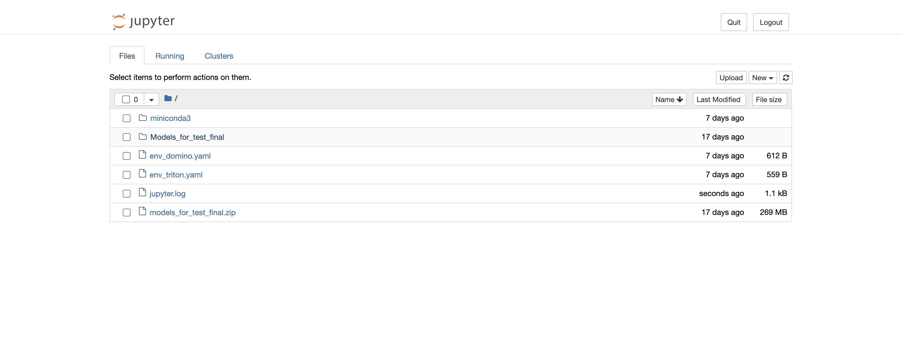
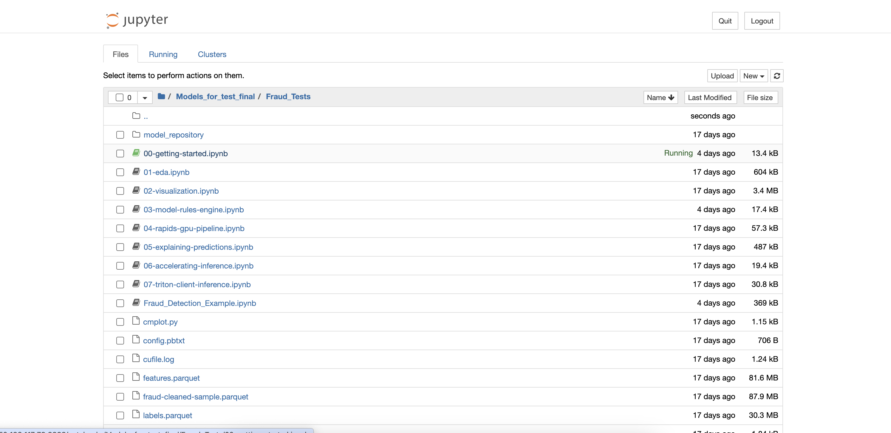

# Run JupyterHub Notebook

## Introduction

This lab will take you through the steps needed to run Fraud detection examples in the jupyter notebook. We have following Fraud detection models

**Fraud_Detection_models
The instances contains Jupyter notebooks for the following Fraud Detection models:
[https://domino.ai/blog/credit-card-fraud-detection-using-xgboost-smote-and-threshold-moving](https://domino.ai/blog/credit-card-fraud-detection-using-xgboost-smote-and-threshold-moving)

[https://www.nvidia.com/en-us/launchpad/data-science/deploy-a-fraud-detection-xgboost-model-using-triton/](https://www.nvidia.com/en-us/launchpad/data-science/deploy-a-fraud-detection-xgboost-model-using-triton/)

The above fraud detection lab is split into three parts:

1. In the first part, you will work in Jupyter notebooks to explore the data, and train a machine learning model.
2. In the second part of the lab, you will work in a VM console, and deploy the trained model on the Triton Inference Server.
3. Finally, you'll use a client application Jupyter Notebook to make predictions and detect fraudulent transactions using the Triton Inference Server. You will access each part of the lab using the links in the left-hand navigation pane.

To give you a general overview, XGBoost is an optimized distributed gradient boosting library designed to be highly efficient, flexible and portable. It implements machine learning algorithms under the Gradient Boosting framework. XGBoost provides a parallel tree boosting (also known as GBDT, GBM) that solve many data science problems in a fast and accurate way. The same code runs on major distributed environment (Hadoop, SGE, MPI) and can solve problems beyond billions of examples.

Estimated Time: 1 hour 30 minutes

### Objectives

To execute Fraud detection models in Jupyter Notebook.
To execute/modify the notebooks you can use following environments based on the examples location (the notebooks are already saved with the kernel components):

**Models_for_test_final/Fraud_Tests/* works with triton_example_kernel**
**Models_for_test_final/XGBOOST_SMOTE_Domino Credit_Card_Fraud_Detection_using_XGBoost_GPU works with domino_example_kernel**

### Prerequisites

This lab assumes you have:

* An Oracle Cloud account
* Administrator permissions or permissions to use the OCI Compute and Identity Domains
* Access to A10 or GPU shape, Usage of the Terraform code for one click deployment.

## Task 1: Run Fraud Tests Example

1. Copy the URL created in the last lab and paste in a browser of your choice to access JupyterHub as shown in the image below and click on *Models_for_test_final*

    

2. We will go through Fraud tests examples first. Click on *Fraud_Tests* to open example notebooks as shown below.

    

3. Click on *00-getting-started* to open first notebook. It introduces Jupyter notebooks, covering how to edit and execute cells, use built-in Python functions for help, restart and clean up the kernel, and manage GPU memory. 
Different types (prose, code, UI elements), editing and execution. How to restart the kernel and run up to the selected cell.

4. Click on *01-eda* to open this notebook. It presents how to explore data through exploratory analysis, including examining variable distributions, identifying patterns, and comparing features like transaction types and amounts to uncover insights before transitioning to more advanced analysis techniques.
Examine data structure and column types, identify categorical and continuous variables. Analyze distribution of transaction types and foreign vs. domestic transactions. Evaluate transaction amounts, explore distributions, and assess time gaps between transactions.

5. Click on *02-visualization* to open this notebook. It presents how to visualize multidimensional data using PCA and UMAP, leveraging RAPIDS and NVIDIA GPUs for dimensionality reduction and interactive exploration.
Reduce dimensions, emphasize variance, requiring scaled numeric features and encoded categorical data. Nonlinear dimensionality reduction with key hyperparameters like n_neighbors and min_dist.

6. Click on *03-model-rules-engine* to open this notebook. It presents how to create and evaluate a rule-based fraud detection system, focusing on defining rules, calculating performance metrics, and comparing results with more advanced models.
Define simple rules for fraud detection (e.g., amount > $200), evaluate performance using precision and recall, refine rules, and compare rule-based performance with advanced models.

7. Click on *04-rapids-gpu-pipeline* to open this notebook. It presents how to train and to  evaluate XGBoost models on NVIDIA GPUs with RAPIDS, including data encoding, model storage, performance comparison with CPU, and hyperparameter tuning.
Import RAPIDS libraries, load and split data. Perform one-hot and target encoding for categorical features, impute and scale numerical features. Train XGBoost model on GPU, store and serialize model. Compare GPU vs CPU training time and accuracy, evaluate metrics, and adjust sample size. Experiment with XGBoost parameters to optimize performance and reduce false positives.

8. Click on *05-explaining-predictions* to open this notebook. It presents XGBoost model predictions using SHAP values for better model interpretability, feature importance, and interactions.
Explain model predictions and feature importance using SHAP values. Compute feature importance on GPU and identify feature interactions. Plot feature importance and interactions, comparing GPU vs CPU performance.

9. Click on *06-accelerating-inference* to open this notebook. It presents installation of Triton client, monitoring server logs, ensuring correct categorical variable handling, and using the same data frame for consistency.
Install Triton client requirements. Connect to Triton server, ensuring it is online and error-free. Deploy models and submit requests, handling categorical variables correctly.

10. Click on *07-triton-client-inference* to open this notebook. It presents inference with NVIDIA Triton Inference FIL backend: setup, server connection, inference requests, and handling categorical variables.

11. Click on *Fraud_Detection_Example* to open this notebook. It presents how to train and deploy an XGBoost fraud detection model using Triton-FIL backend for optimized performance analysis and real-time serving.
Utilizes IEEE-CIS Fraud Detection dataset and trains XGBoost models, supporting categorical variables. Models are serialized for Triton Inference Server, deployed on GPUs for higher throughput and lower latency. Triton's tools like perf_analyzer are used for tuning and comparing CPU vs GPU performance.

## Task 2: Run XGBOOST_SMOTE_Domino example

1. Copy the URL created in the last lab and paste in a browser of your choice to access JupyterHub and click on *Models_for_test_final*. This time we will go through *XGBOOST_SMOTE_Domino*. Click on *XGBOOST_SMOTE_Domino* as shown below

    

2. Click on the *Credit_Card_Fraud_Detection_using_XGBoost_GPU* to open this notebook. It explores a credit card fraud detection approach using XGBoost, SMOTE, and threshold moving. It begins with preprocessing data to handle class imbalance with SMOTE, followed by training an XGBoost model to detect fraud. The key enhancement involves adjusting the decision threshold to improve performance metrics like precision and recall, resulting in better fraud detection accuracy. The approach emphasizes the importance of threshold tuning for optimizing model performance in fraud detection scenarios.

XGBoost, SMOTE, and threshold moving for classification. Handle class imbalance with SMOTE, train XGBoost classifier, and adjust thresholds for better performance. Improved accuracy, effective handling of imbalance, and optimized performance through threshold tuning.
    
This concludes our Workshop.

## Acknowledgements

**Authors**

* **Bogdan Bazarca**, Senior Cloud Engineer, NACIE
* **Abhinav Jain**, Senior Cloud Engineer, NACIE