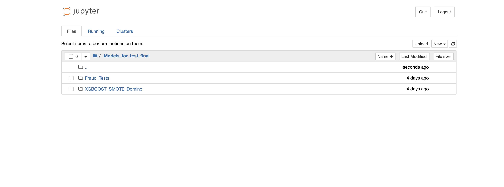

# Run JupyterHub Notebook

## Introduction

This lab will take you through the steps needed to run Fraud detection examples in the jupyter notebook. We have following Fraud detection models

**Fraud Detection models**
The instances contains Jupyter notebooks for the following Fraud Detection models:
[https://domino.ai/blog/credit-card-fraud-detection-using-xgboost-smote-and-threshold-moving](https://domino.ai/blog/credit-card-fraud-detection-using-xgboost-smote-and-threshold-moving)

[https://www.nvidia.com/en-us/launchpad/data-science/deploy-a-fraud-detection-xgboost-model-using-triton/](https://www.nvidia.com/en-us/launchpad/data-science/deploy-a-fraud-detection-xgboost-model-using-triton/)

The above fraud detection lab is split into three parts:

1. In the first part, you will work in Jupyter notebooks to explore the data, and train a machine learning model.
2. In the second part of the lab, you will work in a VM console, and deploy the trained model on the Triton Inference Server.
3. Finally, you'll use a client application Jupyter Notebook to make predictions and detect fraudulent transactions using the Triton Inference Server. You will access each part of the lab using the links in the left-hand navigation pane.

To give you a general overview, XGBoost is an optimized distributed gradient boosting library designed to be highly efficient, flexible and portable. It implements machine learning algorithms under the Gradient Boosting framework. XGBoost provides a parallel tree boosting (also known as GBDT, GBM) that solve many data science problems in a fast and accurate way. The same code runs on major distributed environment (Hadoop, SGE, MPI) and can solve problems beyond billions of examples.

Estimated Time: 1 hour 30 minutes

### Objectives

To execute Fraud detection models in Jupyter Notebook.
To execute/modify the notebooks you can use following environments based on the examples location (the notebooks are already saved with the kernel components):

**Models for test final/FraudTests/** - Works with triton example kernel

**Models for test final/XGBOOST SMOTE Domino** - Credit Card Fraud Detection using XGBoost GPU works with domino example kernel

### Prerequisites

This lab assumes you have:

* An Oracle Cloud account
* Administrator permissions or permissions to use the OCI Compute and Identity Domains
* Access to A10 or GPU shape, Usage of the Terraform code for one click deployment.

## Task 1: Run Fraud Tests Example

1. Copy the URL created in the last lab and paste in a browser of your choice to access JupyterHub as shown in the image below and click on *Models for test final*

    

2. We will go through Fraud tests examples first. Click on *Fraud_Tests* to open example notebooks as shown below.

    

3. Click on *00-getting-started* to open first notebook. It introduces Jupyter notebooks, covering how to edit and execute cells, use built-in Python functions for help, restart and clean up the kernel, and manage GPU memory.

4. Click on *01-eda* to open this notebook. It presents how to explore data through exploratory analysis, including examining variable distributions, identifying patterns, and comparing features like transaction types and amounts to uncover insights before transitioning to more advanced analysis techniques.

5. Click on *02-visualization* to open this notebook. It presents how to visualize multidimensional data using PCA and UMAP, leveraging RAPIDS and NVIDIA GPUs for dimensionality reduction and interactive exploration.

6. Click on *03-model-rules-engine* to open this notebook. It presents how to create and evaluate a rule-based fraud detection system, focusing on defining rules, calculating performance metrics, and comparing results with more advanced models.

7. Click on *04-rapids-gpu-pipeline* to open this notebook. It presents how to train and to  evaluate XGBoost models on NVIDIA GPUs with RAPIDS, including data encoding, model storage, performance comparison with CPU, and hyperparameter tuning.

8. Click on *05-explaining-predictions* to open this notebook. It presents XGBoost model predictions using SHAP values for better model interpretability, feature importance, and interactions.

9. Click on *06-accelerating-inference* to open this notebook. It presents installation of Triton client, monitoring server logs, ensuring correct categorical variable handling, and using the same data frame for consistency.

10. Click on *07-triton-client-inference* to open this notebook. It presents inference with NVIDIA Triton Inference FIL backend: setup, server connection, inference requests, and handling categorical variables.

11. Click on *Fraud_Detection_Example* to open this notebook. It presents how to train and deploy an XGBoost fraud detection model using Triton-FIL backend for optimized performance analysis and real-time serving.

## Task 2: Run XGBOOST SMOTE Domino example

1. Copy the URL created in the last lab and paste in a browser of your choice to access JupyterHub and click on *Models for test final*. This time we will go through *XGBOOST SMOTE Domino*. Click on *XGBOOST SMOTE Domino* as shown below

    

2. Click on the *Credit_Card_Fraud_Detection_using_XGBoost_GPU* to open this notebook. It explores a credit card fraud detection approach using XGBoost, SMOTE, and threshold moving. It begins with preprocessing data to handle class imbalance with SMOTE, followed by training an XGBoost model to detect fraud. The key enhancement involves adjusting the decision threshold to improve performance metrics like precision and recall, resulting in better fraud detection accuracy. The approach emphasizes the importance of threshold tuning for optimizing model performance in fraud detection scenarios.

    XGBoost, SMOTE, and threshold moving for classification. Handle class imbalance with SMOTE, train XGBoost classifier, and adjust thresholds for better performance. Improved accuracy, effective handling of imbalance, and optimized performance through threshold tuning.

This concludes our Workshop.

## Acknowledgements

**Authors**

* **Bogdan Bazarca**, Senior Cloud Engineer, NACIE
* **Abhinav Jain**, Senior Cloud Engineer, NACIE