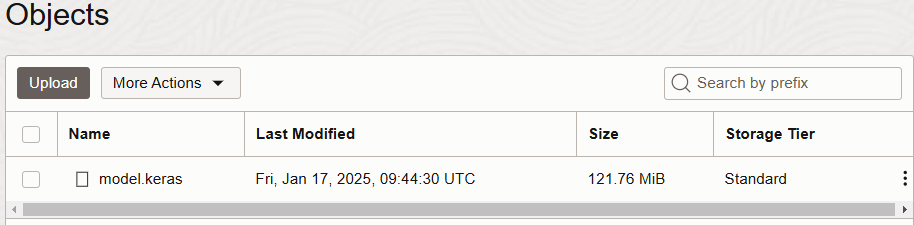
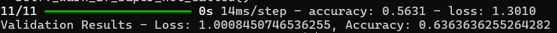

# Train and validate the model

## Introduction

In this lab, you will train and validate a machine learning (ML) model using medical images. The lab demonstrates how to leverage Oracle Cloud Infrastructure (OCI) and Argo Workflows to create an end-to-end ML pipeline, from uploading images to training the model and validating its accuracy.

### Objectives

* Train an ML model on medical images.
* Validate the model's performance post-training.

Estimated Time: 30 minutes

### Prerequisites

This lab assumes you have:

* An Oracle Cloud account
* Administrator privileges or access rights to the OCI tenancy
* Ability to create resources with Public IP addresses (Load Balancer, Instances, OKE API Endpoint)
* Ability to create OCI Functions
* Ability to create Dynamic Groups
* An OCI Auth token generated

## Task 1: Upload medical images to the Object Storage bucket

1. In the web console got to _Storage_ -> _Object Storage_ -> _Buckets_ and select the **medical-images-raw bucket**.

2. In this bucket you can upload any medical images that you want but they need to be of the same type(x-ray of brest cancer for example) and you should upload at least 10 files at first. They need to be of type **.jpg or .png**.

3. You can verify that the model was trained once the **model.keras** file appears in the _trained-model_ bucket. This may take up to 10 minutes to finish execution.

    

## Task 2: Validate the model

1. SSH back into the operator and into the **ml\_training\_medical\_images** directory.

2. Install the requirements for the validation script using the following command:

    ```
    <copy>
    pip3.10 install -r requirements.txt
    </copy>
    ```

3. Execute the validate_model.py file using the following command:

    ```
    <copy>
    python3.10 validate_model.py
    </copy>
    ```

4. The script validates against the images that were used for training and will return how accurate the training was.

    

This concludes our ML pipeline using OCI and Argo workflows.

## Acknowledgements

**Authors**

* **Dragos Nicu**, Senior Cloud Engineer, NACIE
* **Last Updated By/Date** - Dragos Nicu, January 2025
