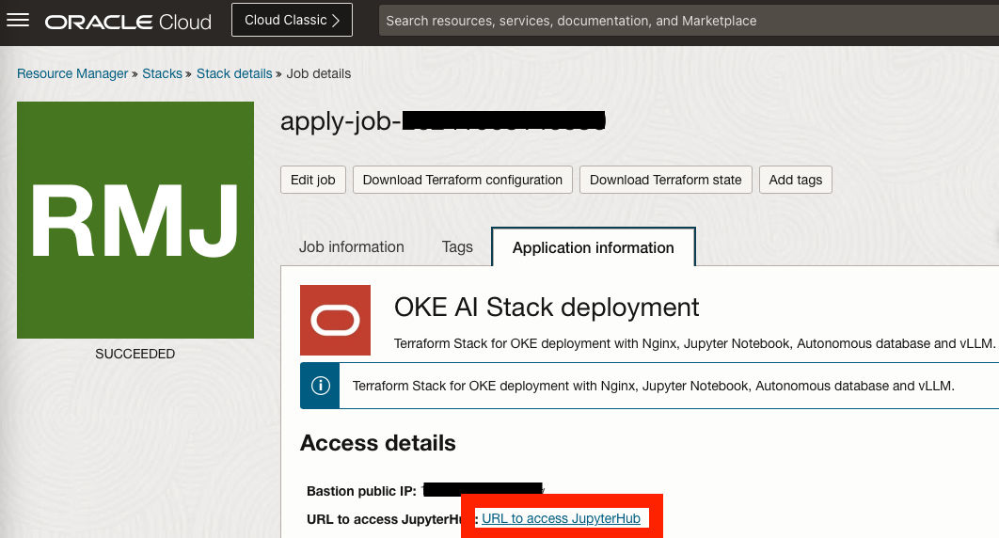
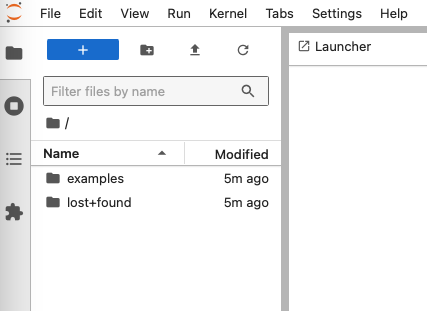
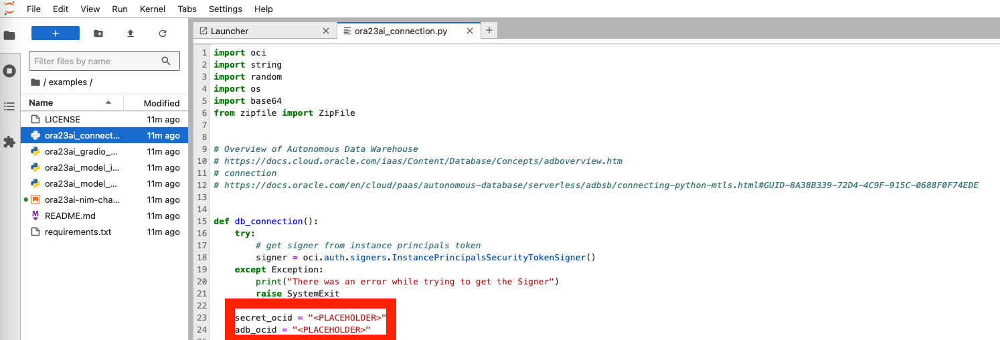
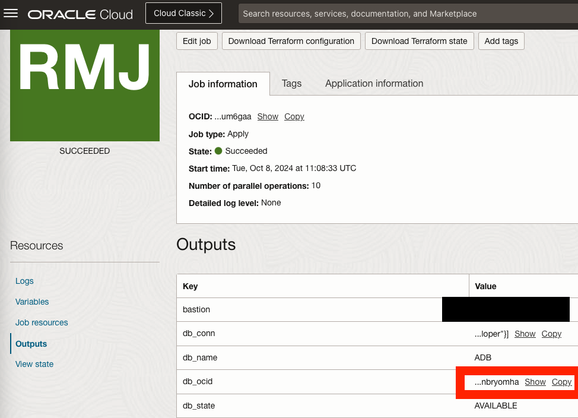
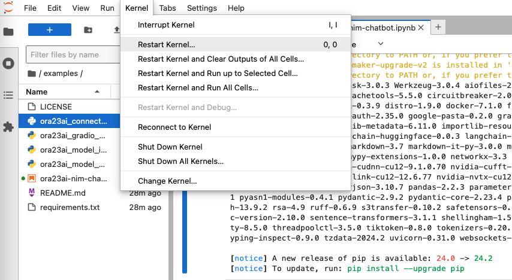
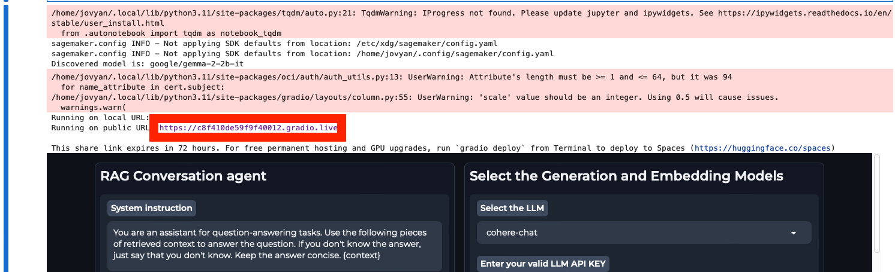

# Run JupyterHub Notebook to chat with LLM

## Introduction

This lab will guide you through the steps needed to run the JupyterHub notebook.

Estimated Time: 1 hour 30 minutes

### Objectives

This lab contains an example on how to chat with the LLM chatbot.

### Prerequisites

This lab assumes you have:

* An Oracle Cloud account
* Administrator privileges or access rights to the OCI tenancy
* Ability to provision A10 instances in OCI
* Ability to provision an Oracle 23ai Autonomous Database
* Ability to create resources with Public IP addresses (Load Balancer, Instances, OKE API Endpoint)
* Access to Hugging Face and acceptance of selected model license agreements
* A Hugging Face token with at least read permissions (steps to create)
* Database admin password stored in a vault secret.

## Task 1: Run JupyterHub Notebook

1. Once the job has succeeded go to Stack details -> Application Information and click the link provided at URL to access JupyterHub as shown in below image.

    

2. A new tab will open in which you need to enter the username and password that was setup during the Resource Manager stack creation.

3. It may take few seconds for the pod to run the code on the cluster. Just wait till the processing is complete.

## Task 2: Run the Example

1. On the left hand panel of the screen you will see examples. Click on it to view 3 pre packaged examples as shown in the image below.

    

2. Before running the Jupyter notebook we need to complete the vault secret OCID where the DB admin password is stored as well as the ADB OCID. Open the ora23ai_connection.py file and locate the variables as seen in the below image.

    

    The ADB OCID can be obtained from the output section of th stack apply job as shown in below image.

    

    Paste both variables between the "" and hit Ctrl+s to save the file.

3. Close the ora23ai_connection.py file once the variables are set and open the ora23ai-nim-chatbot.ipynb file. This is the Jupyter notebook that will create the chatbot and install the libraries.

    To install the libraries go to the first cell block and hit Shift+Enter to execute it.

    

4. After the libraries finish installing(this takes a 2-3 minutes) the next step is to restart the kernel as shown below. 

    

5. Next, execute the second cell block by hitting Shift+Enter.

    

6. Finally, after the second cell finishes execution you will be able to see and access the Gradio interface by using the public URL provided in the output of the cell as seen in below image.

    

This concludes our Jupyter Hub setup.

You may proceed to the next lab.

## Acknowledgements

**Authors**

* **Dragos Nicu**, Senior Cloud Engineer, NACIE
* **Guido Alejandro Ferreyra**, Principal Cloud Architect,NACIE
