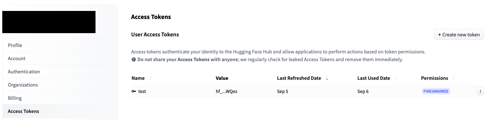

# Provision of resources to run JupyterHub Notebook

## Introduction

This lab will guide you through the steps needed to provision the infrastructure using Resource manager.

Estimated Time: 30 minutes

### Objectives

Provisioning of the infrastructure using OCI Resource Manage.

### Prerequisites

This lab assumes you have:

* An Oracle Cloud account
* Administrator permissions or permissions to use the OCI tenancy
* Ability to spin-up A10 instances in OCI
* Ability to spin-up an Oracle 23ai Autonomous Database
* Ability to create resources with Public IP addresses (Load Balancer, Instances, OKE API Endpoint)
* Access to HuggingFace, accept selected HuggingFace model license agreement.
* Database admin password stored in a vault secret.

## Task 1: Provision resources

1. Go to Resource manager -> Stacks -> Create Stack. Choose My configuration and upload the provided zip file and click Next: [terraform-oke-vllm-ora23ai.zip](https://objectstorage.eu-frankfurt-1.oraclecloud.com/p/1S-rMvxqTZDtyXZoq_QC6PvaEdqn_tvj9tZICRj9iWPGCv-2BoXcbIEg1zUJt89H/n/ocisateam/b/LiveLabs/o/terraform-oke-ora23ai.zip)

    

    Or you could use a single click deployment button shown below

    

2. Provide the information for **Compartment**, **Kubernetes Cluster Name (Any suitable name)** , **Check Create new VCN**, **VCN Name (Any suitable name)**, **Leave other Networking information as default**, **Kubernetes nodepool configuration (Change the GPU nodepool size to two and the rest can be left as default or be changed as seen fit)**

3. Next, check all 3 options in Access to the Kubernetes cluster and provide your ssh key to connect to the bastion and operator hosts.

    You can deploy the resources in two ways. Either you create a bastion and operator hosts. These are two VMs and operator host would be configured with kubectl so you can directly execute command from operator against the kubernetes cluster or commands can be executed from oracle resource manager runner.

    If you do not select this option then it is mandatory to have a public OKE endpoint. But if you create bastion and operator hosts then creating a public oke endpoint is optional. For this workshop we will check all 3 and leave as default. Provide your public key to connect to the bastion and operator hosts.

4. In the Autonomous Database configuration provide the OCID of the secret where the ADMIN password for the DB is stored. The rest of the configurations can be changed as needed or leave them as default.

5. Next, in Helm Chart deployments section check all the 3 boxes and leave them as default. No need to provide the optional file. JupyterHub provides the access to the application using the browser. Provide a suitable username and password to access the application in the next lab.

6. Leave JupyterHub - Playbooks Git Repo as default.

7. Check Helm | Deploy vLLM box

8. The model that is being downloaded is from HuggingFace so you have have an account on HuggingFace. The default model is 'google/gemma-2-2b-it'. You will need to go to HuggingFace website and create an account and generate a token to use here. Go to huggingface.co and create an account.

    Go to Profile -> Settings -> Access Tokens and generate a token as shown below

    

9. vLLM API Key is used to secure your LLM deployment. It could be anything you want according to your preference or you can remember. For example it could be "dummy" or "live-lab".

10. The HuggingFace model deployed is 'google/gemma-2-2b-it'.

11. Leave the maximum context length as default '-1'.

12. Click Next and then select Run Apply and finally click on Create as shown below.

    

13. Wait for the Job to succeed. It may take 15-20 minutes for it to be successful and before infrastructure is provisioned.

You may now proceed to the next lab.

## Acknowledgements

**Authors**

* **Dragos Nicu**, Senior Cloud Engineer, NACIE
* **Guido Alejandro Ferreyra**, Principal Cloud Architect,NACIE