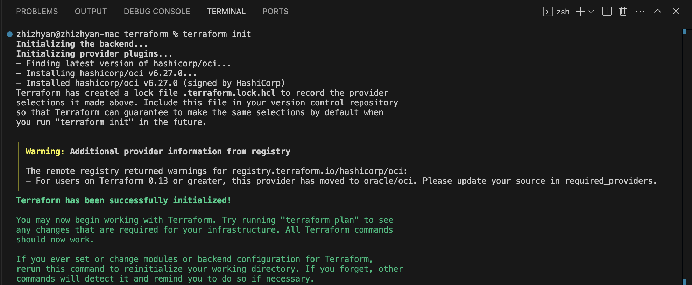
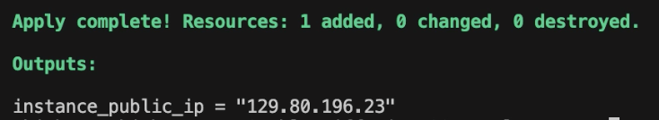

# Lab 1: Deploy A10 GPU on OCI

## Introduction

Oracle Cloud Infrastructure (OCI) Compute provides industry-leading scalability and cost-performance for bare metal and virtual machine instances powered by NVIDIA GPUs for mainstream graphics, AI inference, AI training, digital twins, and HPC. You will deploy a VM.GPU.A10 X9-based GPU instance running Oracle Linux 8 onto OCI by leveraging Terraform.

Estimated Time: 15 minutes

### About Terraform
Terraform is an infrastructure as code tool that lets you define both cloud and on-premise resources in human-readable configuration files that you can version, reuse, and share. You can then use a consistent workflow to provision and manage all of your infrastructure throughout its lifecycle.

### Objectives

In this lab, you will:
* Deploy A10 GPU onto OCI using Terraform 
* Learn common Terraform techniques and practices

### Prerequisites

This lab assumes you have:
* Complete all prerequisites in the intro section

## Task 1: Initialize Terraform

1. Rename `terraform.tfvars.example` to   `terraform.tfvars` and replace the placeholder values with your own

2. Run `terraform init`

    

## Task 2: Create Terraform Execution Plan

1. Run `terraform plan`

    

## Task 3: Deploy the Infrastructure

1. Run `terraform apply`

    
    

Once the public IP address appears in the output, congratulations! You have successfully deployed the required infrastructure for this hands-on lab. **Make sure to note the IP address, as you'll need it later.**

To verify your instance is running, try connecting to it via SSH with `ssh -i /path/to/private_key opc@<public_ip>`. If you need to remove the infrastructure, simply run the command `terraform destroy`.

## Learn More

* [Applying Configurations](https://docs.oracle.com/en-us/iaas/Content/dev/terraform/applying.htm)

## Acknowledgements
* **Author** - Jason Yan, Enterprise Cloud Architect; Blake Ramos, Enterprise Cloud Architect
* **Last Updated By/Date** - Jason Yan, Enterprise Cloud Architect, February 2025
