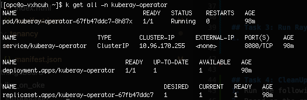
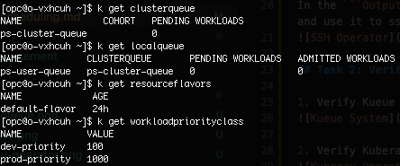
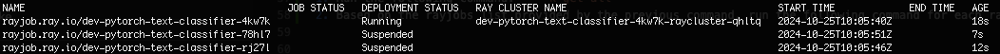
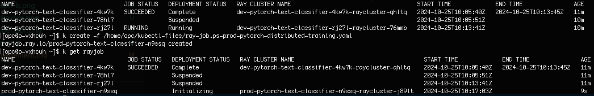

# Priority Scheduling

## Introduction
In this lab, we’ll explore how to leverage Kueue for efficient resource scheduling within OKE clusters while managing AI/ML tasks using the Kuberay-Operator. We’ll set up a simulation of two distinct environments running within the same OKE cluster and how to prioritize between them
 
### Objectives

This lab will guide you through how to:
- use Kueue for priority scheduling of resources in OKE cluster when the cluster resources are shared between DEV/PROD environments
- run AI/ML rayjobs for DEV/PROD environments which have different workload priority class assigned


### Prerequisites

This lab assumes you have:

* An Oracle Cloud account
* Administrator permissions or permissions to use the OCI Compute, OKE and Identity Domains
* Ability to provision A10 vm instances in OCI
* Lab 1. Provision of OCI infrastructure completed


## Task 1: SSH into Operator host
In the ```Outputs``` sections of the apply-job in Resource Manager you will see Key named ``` ssh_to_operator ```, click on ``` Copy ``` at the ```Value``` column of that key and use it to ssh into operator host


## Task 2: Verify if resources needed for the lab are created

1. Verify Kueue is installed with the following command: ```k get all -n kueue-system```. You should have something similar to the screenshot:


2. Verify Kuberay Operator is installed with the following command: ```k get all -n kuberay-operator```. You should have something similar to the screenshot below:


3. Verify localqueue, clusterqueue, resourceflavors and workloadpriorityclass are deployed with the following commands: 
```
k get clusterqueue
k get localqueue
k get resourceflavors
k get workloadpriorityclass
```

You should have something similar to the screenshot:



## Task 3: Run multiple rayjobs for DEV environment
1. In ```/home/opc``` you have a folder named ```kubectl-files```. Under that folder you have multiple yaml files. For this lab we will use ```ray-job.ps-dev-pytorch-distributed-training.yaml``` and ```ray-job.ps-prod-pytorch-distributed-training.yaml```.
2. First you will run three times the following command: 
``` 
k create -f /home/opc/kubectl-files/ray-job.ps-dev-pytorch-distributed-training.yaml
```
This command will create rayjobs which deploys pods that runs a **Fine-tuning model of PyTorch Lightning Text Classifier**. For first job that runs this it will take up to 25 minutes because it pulls the **rayproject/ray-ml:2.9.0-gpu** image for running the Ray cluster besides the actual run of the fine-tune model into Ray cluster. For the rest of job runs it will take 8-10minutes.
3. If you try a ```k get rayjob``` after you have run the create commands you will see that two rayjobs will be in suspended state and one will be in Initializing and then in Running. In Initializing state is the job when the image for pods is being pulled and in Running state is when the actual ray cluster pods started running.



The jobs will be taken from the queue in the order they were created as they have the same priorityclass assigned. If you look into ```ray-job.ps-dev-pytorch-distributed-training.yaml``` you can see in metadata section the localqueue name and workloadpriorityclass used, as in the screenshot below:


You can wait for the first DEV rayjob to complete and then you go to next task as the rest of DEV rayjobs are still running.


## Task 4: Run rayjobs for DEV and PROD and observe priority scheduling
1. You will run the following commands: 
``` 
k get rayjob /*here you will see one job COMPLETE, one RUNNING and one still SUSPENDED*/
k create -f /home/opc/kubectl-files/ray-job.ps-prod-pytorch-distributed-training.yaml /*here you create the PROD job*/
k get rayjob /*here you will see one job COMPLETE, two jobs SUSPENDED and one RUNNING*/
```

After you run these commands, for the last command you will see that the PROD rayjob is in RUNNING state even though one of the DEV rayjobs were in RUNNING state previously and that DEV rayjobs took SUSPENDED state. 

This happens because PROD rayjobs are considered with higher priority, and Kueue takes that in consideration when prioritizing them preempting DEV jobs when PROD jobs are created.




## Task 5: CleanUp the cluster
1. Run the following command: 
```
k get all 
```
2. Based on the rayjobs list provided by the previous command, run the following command for each rayjob: 
```
k delete rayjob rayjob-name
```


## Acknowledgements

**Authors**

* **Cristian Vlad**, Principal Cloud Architect, NACIE