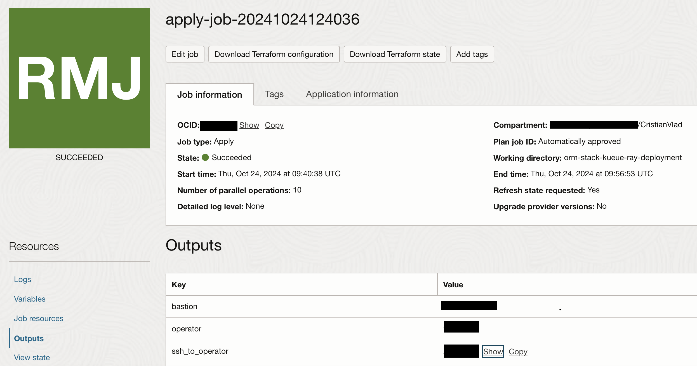
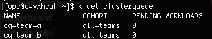
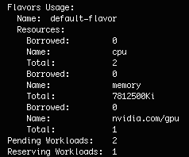
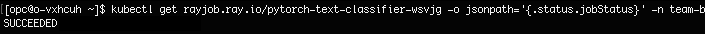
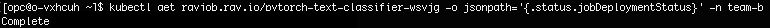

# Quota Management

## Introduction

This lab will demonstrate how to use Kueue for effective resource quota management in OKE clusters, while running AI/ML tasks across multiple namespaces with Kuberay-Operator. In this lab we will simulate two teams operating in separate namespaces, each with dedicated resources that they can share with one another as needed.
 
Estimated Workshop Time: 1 h

### Objectives

This lab will guide you through how to:
- use Kueue for quota management of resources in OKE cluster when there are multiple teams that share resource in the cluster
- run AI/ML jobs in multiple namespaces using Kuberay-Operator

### Prerequisites

This lab assumes you have:

* An Oracle Cloud account
* Administrator permissions or permissions to use the OCI Compute, OKE and Identity Domains
* Ability to provision A10 vm instances in OCI
* Lab 1. Provision of OCI infrastructure completed


## Task 1: SSH into Operator host
In the ```Outputs``` sections of the apply-job in Resource Manager you will see Key named ```ssh_to_operator```, click on ``` Copy ``` at the ```Value``` column of that key and use it to ssh into operator host


## Task 2: Verify if resources needed for the lab are created

1. Verify Kueue is installed with the following command: ```k get all -n kueue-system```. You should have something similar to the screenshot:


2. Verify Kuberay Operator is installed with the following command: ```k get all -n kuberay-operator```. You should have something similar to the screenshot below:


3. Verify localqueue and clusterqueue are deployed with the following commands: 
```
k get clusterqueue 
k get localqueue -n team-a 
k get localqueue -n team-b 
```
Note: ClusterQueues are cluster-wide objects that manage a shared pool of resources (CPU, memory, hardware accelerators) and LocalQueues are namespace-specific objects linked to ClusterQueues, enabling resource allocation from the cluster pool to support LocalQueue workloads. 

In our example *cq-team-a* and *cq-team-b* share the same cohort *all-teams* and this means they can borrow unused quota from each other. You will see something similar to the screenshots below:
    


## Task 3: Run Rayjob with Fine-tune a PyTorch Lightning Text Classifier and observe the admitted workloads
1. In ```/home/opc``` you have a folder named ```kubectl-files```. Under that folder you have multiple yaml files. For this lab we will use ```ray-job.pytorch-team-a.yaml``` and ```ray-job.pytorch-team-b.yaml```. 
2. First you will run the following command: 
``` 
k create -f /home/opc/kubectl-files/ray-job.pytorch-team-a.yaml
```
This command will create a rayjob which deploys a pod that runs a **Fine-tuning model of PyTorch Lightning Text Classifier**. For first job that runs this it will take up to 25 minutes because it pulls the **rayproject/ray-ml:2.9.0-gpu** image for running the Ray cluster besides the actual run of the fine-tune model into Ray cluster. For the rest of job runs it will take 8-10minutes

3. While you are waiting for the rayjob to finish you can observe:
- in ```ray-job.pytorch-team-a.yaml``` file and see that the job it is created under **team-a** namespace. The same for ```ray-job.pytorch-team-b.yaml``` it will be create under **team-b** namespace


- if you run ```k describe rayjob rayjob-name -n team-a``` the status of the job.
- if you run ```k describe clusterqueue cq-team-a``` you will see under **Flavors Usage** the resources borrowed by the job from team-a to run.
- if you run ```k create -f /home/opc/kubectl-files/ray-job.pytorch-team-b.yaml``` multiple times and then run ```k describe clusterqueue cq-team-b``` you will see under **Flavors Usage** how many Pending Workloads you have and how many Reserving Workloads you have.

- in order to see when the job is finished run the following commands:

```
kubectl get rayjobs.ray.io rayjob-name -o jsonpath='{.status.jobStatus}' -n team-a/b

kubectl get rayjobs.ray.io rayjob-name -o jsonpath='{.status.jobDeploymentStatus}' -n team-a/b
```





## Task 4: CleanUp the cluster
1. Run the following command: 
``` 
k get rayjob -n team-a
k get rayjob -n team-b
```
2. Based on the rayjobs list provided by the previous command, run the following command for each rayjob: 
```
k delete rayjob <rayjob_name> -n team-<ab>
```  
This will also remove the pods created within the jobs.


## Learn More

* [What is cohort?](https://kueue.sigs.k8s.io/docs/concepts/cluster_queue/#cohort)


## Acknowledgements

**Authors**

* **Cristian Vlad**, Principal Cloud Architect, NACIE