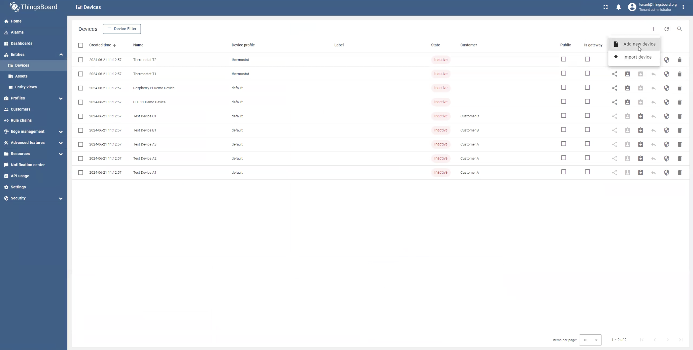
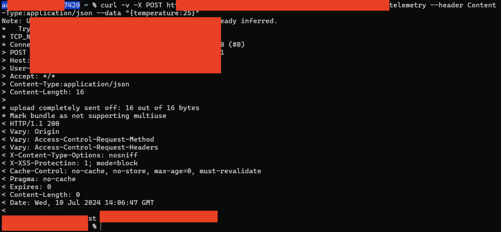
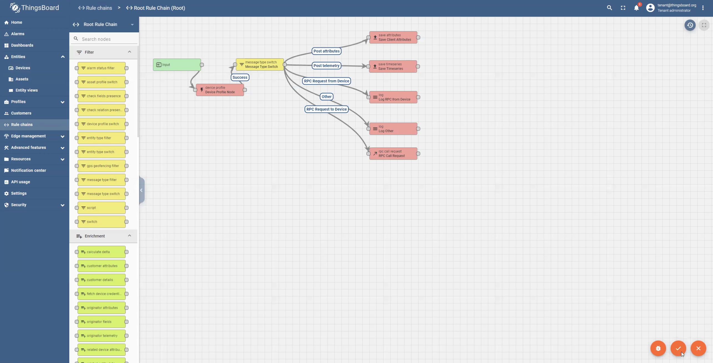
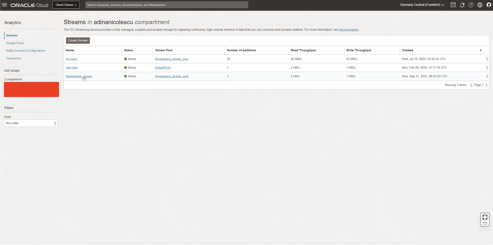
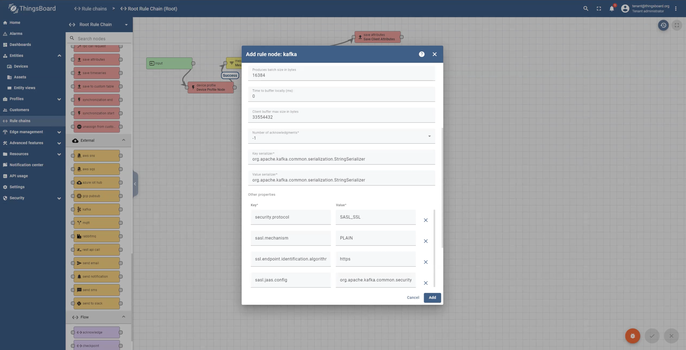
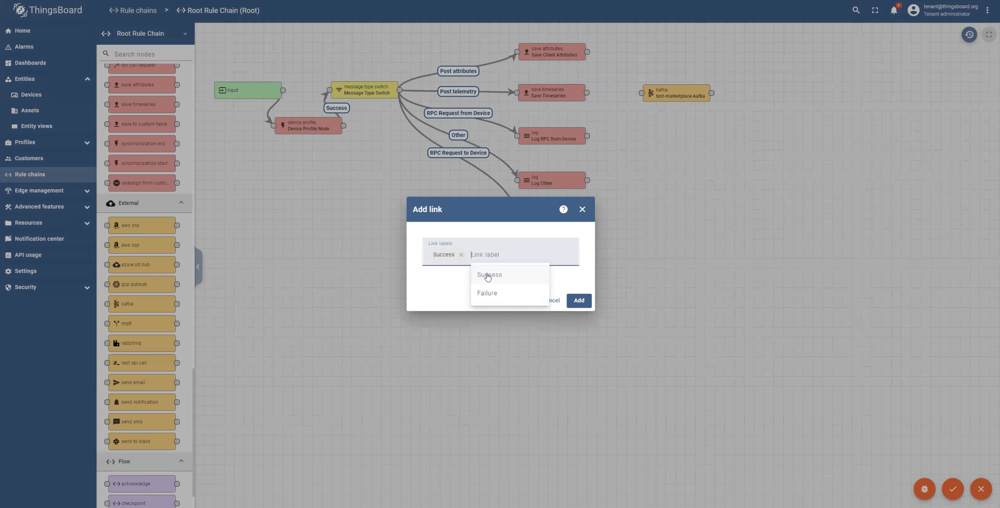
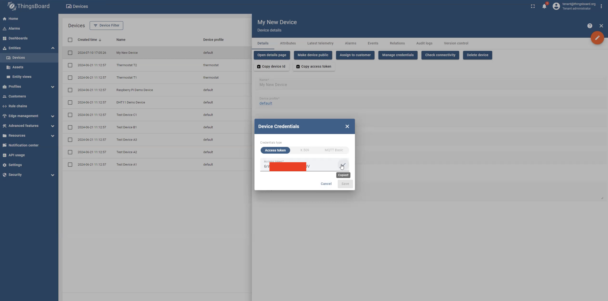
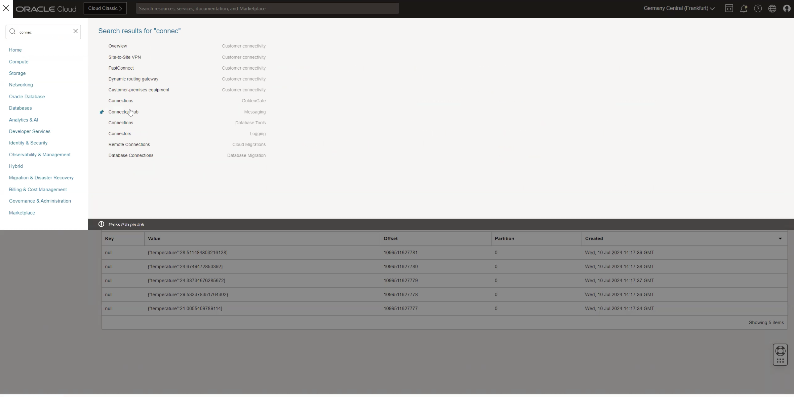

# Integrating ThingsBoard with OCI: Streaming Sensor Data and Connecting to OCI Services

## Introduction

This lab will guide you through the process of passing sensor data from ThingsBoard into OCI. We’ll use OCI Streaming as the entry point for the data.

Estimated Time: 1 hour

### Objectives

This lab will demonstrate how to route data from  ThingsBoard, where it may undergo different transformation, into OCI. The integration is facilitated by OCI Streaming, which is Kafka under the hood, and you will leverage the Connector Hub service to forward the data to other services within OCI.

### Prerequisites

This lab assumes you have:

* An Oracle account.
* Administrator permissions or permissions to use the OCI Streaming, OCI Compute and Identity Domains.

## Task 1: Add a device

1. Go to Entities -> Devices -> Add new device by clicking on the plus sign. Please find the image below

    

2. Give it a name and click on Add. Leave everything else as default.

3. Go to the Linux tab in the new opened window and save the curl command in your notes for later use. You can use this command to send data from your machine to Thingsboard.

4. You can also find this information in the Check connectivity section of Devices. Also, go to Manage Credentials and save Access Token for later use. It will be used in Task 4 of this lab. Please find it shown in the image below.

    

## Task 2: Simulate incoming sensor data

1. Go to terminal on your laptop and paste the curl command saved in previous task. This will send a single line of data 'temperature: 25' to Thingsboard. Please find it shown in the image below.

    

2. Go to Devices -> Your_Device -> Latest telemetry and you'll see a new row of data which you just sent using the terminal.

## Task 3: Update Rule Chains

1. Go to Rule chains and click on Root Rule Chain.

    

2. The data we have just sent would be the input for this rule chain and was sent through Post telemetry to Save Timeseries. You should be able to see it in the Save Timeseries by clicking on it. Next, activate the Debug Mode and click on Apply Changes. Next, you'll also have to apply changes to the root level. For that, click on Apply Changes at the bottom right as shown in the image below.

    

3. Double click on Save Timeseries and go to Events tab. Refresh it by clicking on the right side refresh button. If you are still not able to see data go back to Terminal and push the data again using Curl command. Go to Save Timeseries window again and click on Refresh. You should see 'temperature: 25' data here as shown below.

    

4. Next, we will send this data to OCI Streaming using a ThingsBoard external node. For this, go to External nodes section(orange) and drag and drop a Kafka node on the right side of Save Timeseries as shown below.

    

5. Click on Kafka node and a new window will open. Fill in the Name (Anything) and Topic Pattern information. Topic Pattern would be an existing stream in OCI. If you do not already have a stream go to OCI dashboard and create a new stream as shown below.

    

6. Continue filling up the information in Kafka window. Next would be Bootstrap servers. To find this go to your stream in OCI and click on Stream Pool as shown in the image below. Next, click on Kafka Connection Settings under Resources on the left hand panel of the screen. Copy the Bootstrap Servers information from here and paste it in the Kafka window.

    

7. Next, scroll down to the bottom of the window and fill Key-Value information in Other Properties section as shown in the image below.

    * **security.protocol** : SASL_SSL
    * **sasl.mechanism** : PLAIN
    * **ssl.endpoint.identification.algorithm** : https
    * **sasl.jaas.config** : *SASL Connection Strings*

    

    The SASL Connection Strings can be copied from Kafka Connection Settings. It'd be something like this

    *org.apache.kafka.common.security.plain.PlainLoginModule required username=”//" password="AUTH_TOKEN";*

    You may need to add 'oracleidentitycloudservice' between your tenancy and email address in the username part of this string depending on the type of your account.

    To generate an AUTHTOKEN go to the top-right corner of the OCI Dashboardscreen, click on the profile icon. UnderUser Profile, click Auth Token, generate a token and copy the value: AUTHTOKEN. You can also use an existing token.

8. Next, connect the Save Timeseries box with the Kafka box and select link label as Success as shown in the image below. Also, save it by clicking on the Apply Changes button in the bottom right of the screen.

    

9. Click on Kafka box and activate the Debug mode. Click on the Events Tab in the Kafka box and click refresh button to see if you have data available. If not, push the data again through terminal using the Curl command and refresh the Kafka screen again to see if data is available as shown in the image below.

    

## Task 4: Ingest Data in Streams

1. Go to OCI Streaming service in OCI Dashboard and click on your existing stream which you have used to send the data. Click on Load Messages and you'll see a new row of data with 'temperature: 25' coming from Thingsboard as shown below. This will be visible only if the curl command was executed in the last minute, so if needed please resend the temperature reading.

    

2. Use the following python script to send a random temperature after every second. Click on the link to download the script: [send_telemetry.py](https://c4u02.objectstorage.us-ashburn-1.oci.customer-oci.com/p/tfC_fKB7HB5Wo1pvpYu1fHifVw-E7MZruSx9l5J6ebjhGZOwsFawUiJlJhzgR7Hy/n/c4u02/b/hosted_workshops/o/send_telemetry.py)

3. You will need to change the url and device id on line 7 and 8 of the script. In the url section, replace the public ip of the instance. For device id, use Access Token saved in Task 1. Also shown in the image below.

    

4. To run the script type *python3 scriptname.py* from your Terminal. You should have new messages coming in every second. Verify it by clicking on Load Messages in your stream as shown below.

     

## Task 5: Connector Hub

1. Go to OCI dashboard and search for Connector hub and click on it as shown below. Connector hub allows you to transfer data from a source service to a target service in Oracle Cloud Infrastructure. In our case we have Streaming as a source service and target could be anything according to your choice.

    

2. Click on Create connector and provide the following information. Provide the information for **Compartment**, **Connector Name** , **Source (Select Streaming)**, **Target**

    Click **Create**

    

You can select Target according to your preference and play around with the data. This is the end of the workshop.

## Acknowledgements

**Authors**

* **Adina Ion-Nicolescu**, Senior Cloud Engineer, NACIE
* **Abhinav Jain**, Senior Cloud Engineer, NACIE