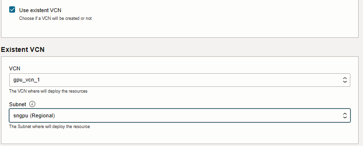
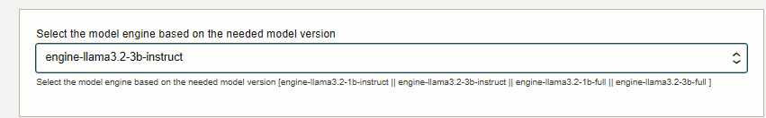
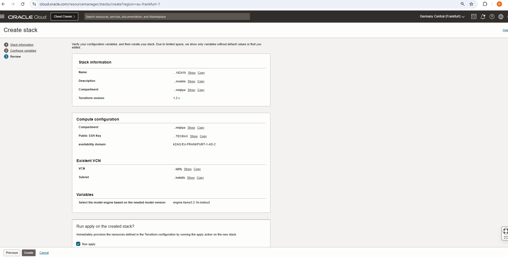

# Provision of resources to run different Llama3.2 models in OCI OKE

## Introduction

This lab will take you through the steps needed to provision the infrastructure using Resource manager and using OCI OKE.

Estimated Time: 30 minutes

### Objectives

Provisioning of infrastructure using Resource manager.

### Prerequisites

This lab assumes you have:

* An Oracle Cloud account
* Administrator permissions or permissions to use the OCI Compute and Identity Domains
* Access to A10 or GPU shape, Usage of the Terraform code for one click deployment.

## Task 1: Provision resources

1. Go to Resource manager -> Stacks -> Create Stack. Choose My configuration and upload the provided zip file and click Next: [orm_code_tritonllm_llama3.2_oke-main.zip](https://github.com/bogdanbazarca/orm_code_tritonllm_llama3.2_A10/archive/refs/heads/main.zip)

    

    Or you could use a single click deployment button shown below

    [](https://cloud.oracle.com/resourcemanager/stacks/create?zipUrl=https://github.com/bogdanbazarca/orm_code_tritonllm_llama3.2_A10/archive/refs/heads/main.zip)

2. Select the options where you want to deploy:
    * a. Compartment, VM display name, Shape, Operating System [Canonical Ubuntu or Oracle Linux],
    Operating System Version [24.04 or 8], Public SSH Key, availability domain, Use existent VCN

    * b. Create new VCN [If Needed, otherwise you can use an existing VCN and a Subnet]


3. Select model engine based on the needed model version:
    * [engine-llama3.2-1b-full or engine-llama3.2-3b-full or engine-llama3.2-1b-instruct or engine-llama3.2-3b-instruct]


4. Click Next and then select Run Apply and finally click on Create as shown below.

    

5. Wait for the Job to succeed. It may take up 30 minutes for it to be successful and before infrastructure is provisioned.

## Task 2: Access the instance

1. Once the stack is created wait for it to complete and then you should be able to connect to the created instance via ssh

2. The stack will provide you at Output the following details:
    * **`SELECTED_MODEL_ENGINE`** [reconfirms the value selected in Task 1 point 3]
    * **`VM_PUB_IP`** [`Instance_Public_IP`]
    * **`VM_PRIV_IP`** [`Instance_Private_IP`]

3. Execute ssh opc@`VM_PUB_IP` in Terminal.

4. Check the cloudinit completion:
```tail -f /var/log/cloud-init-output.log```

5. Allow access for Triton_Inference if you want to use the public IP for queries

    * **Oracle Linux:**

    ```
    sudo firewall-cmd --zone=public --permanent --add-port 8000/tcp
    sudo firewall-cmd --reload
    sudo firewall-cmd --list-all
    ```

    * **Ubuntu:**

    ```
    sudo iptables -L
    sudo iptables -F
    sudo iptables-save > /dev/null
    ```

    If this does not work do also this:

    ```
    sudo systemctl stop iptables
    sudo systemctl disable iptables

    sudo systemctl stop netfilter-persistent
    sudo systemctl disable netfilter-persistent

    sudo iptables -F
    sudo iptables-save > /dev/null
    ```

6. Test tritonllm inference from the created instance (once the cloudinit completes)

    ```
    curl -X POST http://localhost:8000/v2/models/ensemble/generate -d   '{"text_input": "What is machine learning?", "max_tokens": 20, "bad_words": "", "stop_words": ""}'
    ```

7. Test tritonllm inference from the created instance (once the cloudinit completes and firewall rule permits the acces)

    ```
    curl -X POST http://`<instance_public_ip>`:8000/v2/models/ensemble/generate -d   '{"text_input": "What is machine learning?", "max_tokens": 20, "bad_words": "", "stop_words": ""}'
    ```

You may now proceed to the next lab.

## Acknowledgements

**Authors**

* **Bogdan Bazarca**, Senior Cloud Engineer, NACIE
