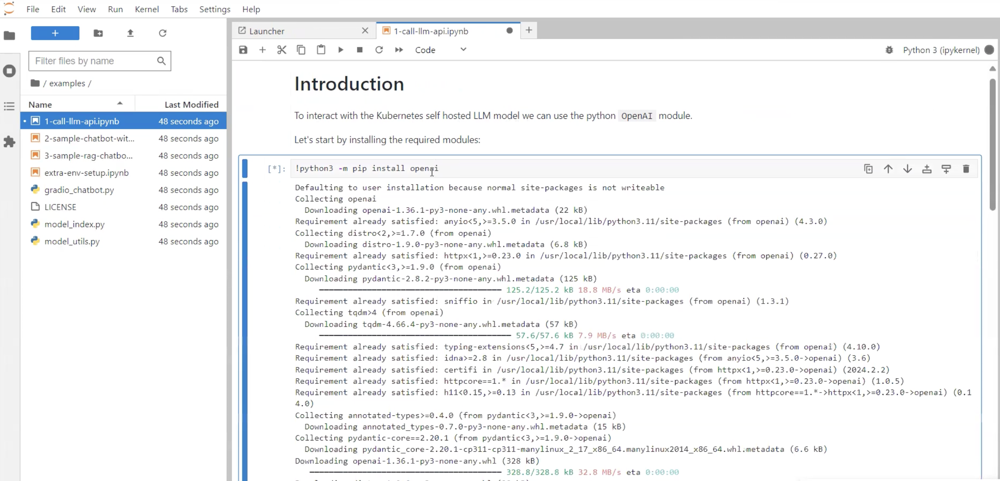
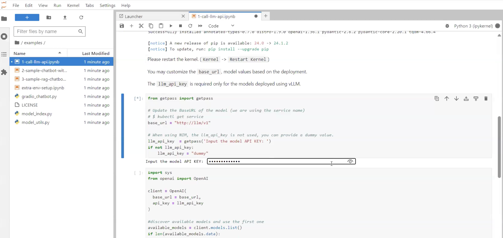
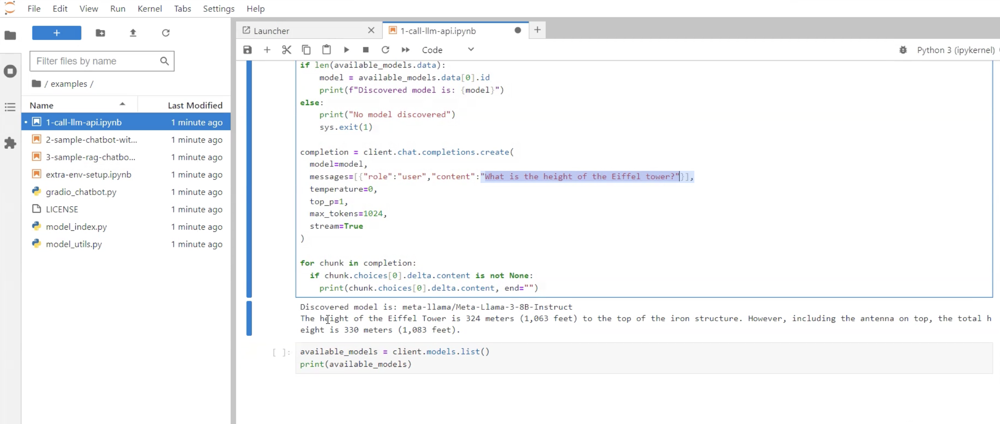

# Run JupyterHub Notebook to chat with LLM

## Introduction

This lab will take you through the steps needed to run the JupyterHub notebook and chat with the application

Estimated Time: 1 hour 30 minutes

### Objectives

This lab contains two examples to chat with the LLM application

### Prerequisites

This lab assumes you have:

* An Oracle Cloud account
* Administrator permissions or permissions to use the OCI tenancy
* Ability to spin-up A10 instances in OCI
* Ability to create resources with Public IP addresses (Load Balancer, Instances, OKE API Endpoint)
* Access to HuggingFace, accept selected HuggingFace model license agreement.

## Task 1: Run JupyterHub Notebook

1. Once the job is succeeded go to Stack details -> Application Information and copy the URL to access JupyterHub as shown in the image below.

    

2. Paste the URL in a browser of your choice and provide the Username and Password which you seet in previous lab in Point 4.

3. It may take few seconds for pod to run the code on cluster. Just wait till the processing is complete.

## Task 2: Run First Example

1. On the left hand panel of the screen you will see examples. Click on it to view 3 pre packaged examples as shown in the image below.

    

2. Click on the first example to open it. In this example you will use the python OpenAI module to interact with the Kubernetes self hosted LLM model but first we will have to install it. 

    To install the openai model go to first box and press Control+Enter on your keyboard to execute first block of code in the notebook as shown below.

    

3. Next step is to restart the kernel as shown below. You may customize the base_url but it is not required.

    

4. Next, input the model API Key and run this block of code. Model API Key will be the same key which was set in last lab on point 8.

    

5. Finally, run the last piece of block. In this block we have asked a question to the model - "What is the height of the Eiffel tower?" and you will see model response at the bottom as shown in the image below. You can also modify the question according to your preference.

    

This concludes our first example. We will move to next task to try out second example.

## Task 3: Run Second Example

1. Click on the second example listed in the left hand panel of the screen. In this example we will use Gradio to create simple Web chatbot app. This application will be using the self hosted LLM.

    

2. Run the first block of code by entering Control+Enter on your keyboard to install the dependencies. Note, you will have to install these dependencies only for the first time.

3. Next, input the model API Key and run this block of code. Model API Key will be the same key which was set in last lab on point 8.

4. Finally, run the last piece of code block to access the application. You can see the application in the notebook but you can also copy the URL as shown in the image below to use in a separate tab in the browser.

    

This concludes our second example. We will try our final RAG example in the next lab.

You may proceed to the next lab.

## Acknowledgements

**Authors**

* **Andrei Ilas**, Master Principal Cloud Architect, NACIE
* **Abhinav Jain**, Senior Cloud Engineer, NACIE