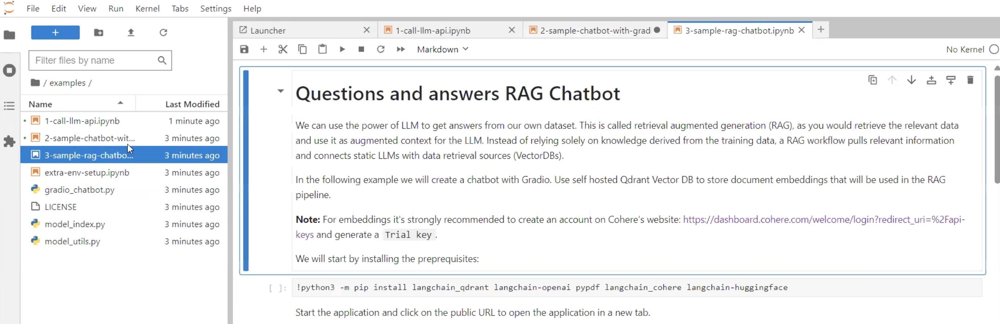

# Retrieval Augmented Generation (RAG) Application

## Introduction

We can use the power of LLM to get answers from our own dataset. This is called retrieval augmented generation (RAG), as you would retrieve the relevant data and use it as augmented context for the LLM. Instead of relying solely on knowledge derived from the training data, a RAG workflow pulls relevant information and connects static LLMs with data retrieval sources (VectorDBs).

In this lab we will create a chatbot with Gradio. Use self hosted Qdrant Vector DB to store document embeddings that will be used in the RAG pipeline.

Note: For embeddings it's strongly recommended to create an account on Cohere's website: [https://dashboard.cohere.com/welcome/login?redirect_uri=%2Fapi-keys](https://dashboard.cohere.com/welcome/login?redirect_uri=%2Fapi-keys) and generate a Trial key.

Estimated Time: 1 hour

### Objectives

This lab will take you through the steps needed to chat with the Retrieval Augmented Generation (RAG) Application

### Prerequisites

This lab assumes you have:

* An Oracle Cloud account
* Administrator permissions or permissions to use the OCI tenancy
* Ability to spin-up A10 instances in OCI
* Ability to create resources with Public IP addresses (Load Balancer, Instances, OKE API Endpoint)
* Access to HuggingFace, accept selected HuggingFace model license agreement.
* Create an account on Cohere's website: [https://dashboard.cohere.com/welcome/login?redirect_uri=%2Fapi-keys](https://dashboard.cohere.com/welcome/login?redirect_uri=%2Fapi-keys) and generate a Trial key.

## Task 1: Run the Retrieval Augmented Generation (RAG) Application

1. Click on the third example listed in the left hand panel of the screen. Run the first piece of code block by entering Control+Enter on your keyboard to install some dependencies. It may take couple of minutes for this intallation to complete.

    

2. In this example you have the choice of selecting the embedding model. You can use the self hosted model but those are running on the CPU not GPU. It is recommended to go to Cohere website and generate a Trial Key to use the Cohere's embedding model.

    In the second block of code you have QDRANT which is the embedding Vector DB already configured and running in the cluster. You have 3 options for embedding models, first two are using the CPU and the last one from Cohere uses GPU.

3. For LLM models you have two options. You can either run the "Nvidia NIM llama3-70b-instruct" or our self hosted model "Meta-Llama-3-8B-Instruct". If you want to use the first one you will have to generate an API Key by going on the Nvidia build website. For the second model you can use the same key which you created in first lab in point 8.

4. Next, run this piece of code block. If it takes too much time you may need to restart the kernel again. Once it is completed you will see RAG application loaded and will also get the URL to access it in a browser as shown below.

    

## Task 2: Chat with the Retrieval Augmented Generation (RAG) Application

1. Copy the RAG application public URL and open it in a separate tab. It will look like as shown below

    

2. Select the LLM model. As mentioned if you select self hosted "Meta-Llama-3-8B-Instruct" API Key will be the same as you created in Lab 1. But if you select "Nvidia NIM llama3-70b-instruct" model you will have to create API Keys on the Nvidia website by creating an account.

3. Enter valid API Keys according to what model you have selected.

4. Select Cohere as Embedding model since it is the only one using GPU.

5. Go to Cohere website and generate a Trial Key to use the Cohere's embedding model. Paste this key in the space provided for embeddings API Key.

6. Click on Load model. You will get a message saying 'Meta-Llama-3-8B-Instruct' and 'cohere' models loaded if you have selected these models and embeddings.

7. Next, upload a document (txt, pdf are supported) in the space provided. Once you see the size of document next to the file name click on Create Vector store. You will get a message saying vector store index is created.

8. Next, you are ready to chat with the application and response will include the document you just uploaded. If you change any Text Generation parameter, you have to Click "Load Model".

9. Once you are ready to terminate your resources you can go to your stack and destroy the stack. All the resources will be terminated except Block volume. You will have to manually delete Block volume.

    

This concludes our RAG application workshop.

## Acknowledgements

**Authors**

* **Andrei Ilas**, Master Principal Cloud Architect, NACIE
* **Abhinav Jain**, Senior Cloud Engineer, NACIE